## 安装python

### 一 如何找到下载地址并下载
> 下面展示找到下载地址的方法步骤
> 嫌步骤太慢可直接跳到第4步，
> 查看详细下载地址

1. 使用搜索引擎搜索python
打开搜索结果中的python官网，即Welcome to Python.org
python官网链接为：[https://www.python.org/](https://www.python.org/)

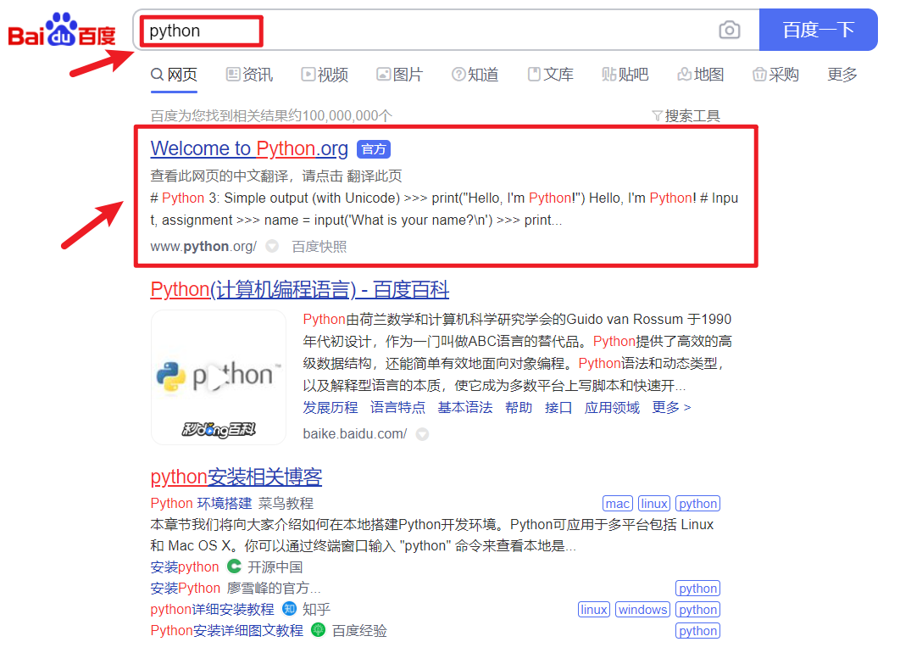

2. 在官网中，点击Downloads->All releases

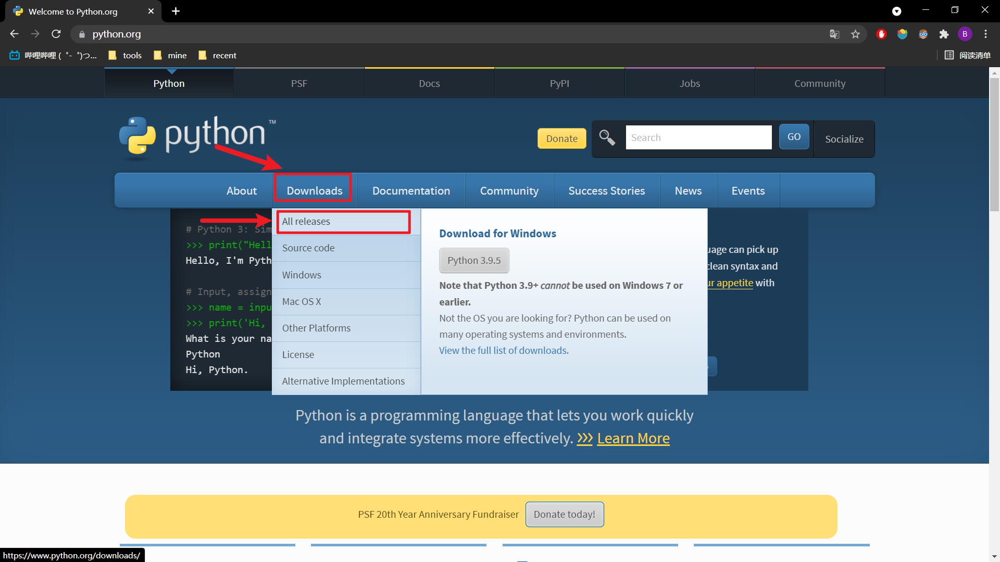

3. 在下面的Looking for a specific release?
寻找自己想要的版本并打开，
我们这里使用3.7.9版本，其对应的链接为：
[https://www.python.org/downloads/release/python-379/](https://www.python.org/downloads/release/python-379/)

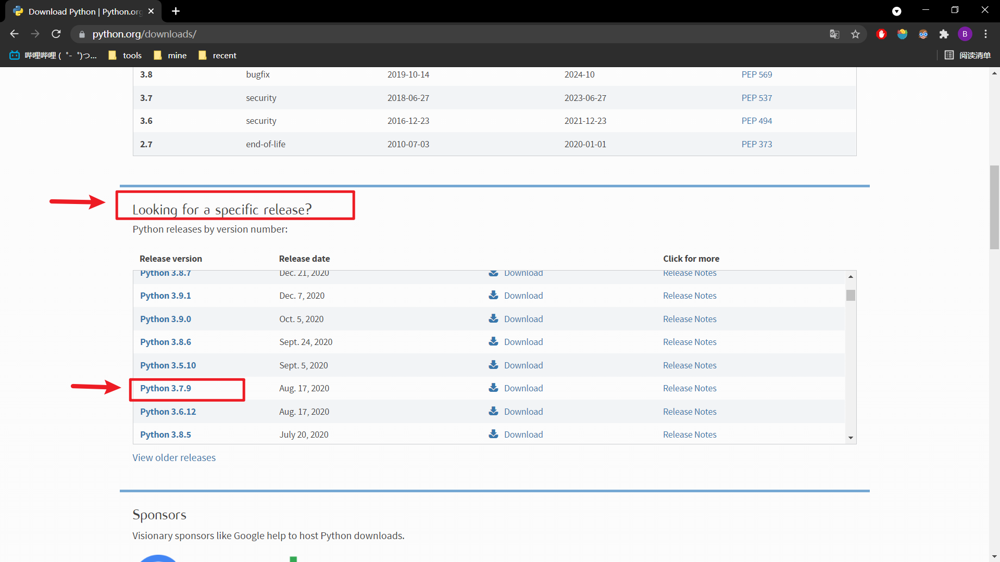

4. 在下面的Files中选择合适的版本：
> 点击下面的链接既可以用浏览器开始下载
> 如果嫌浏览器下载慢的话，可以复制链接到迅雷，用迅雷下载

- 64位windows推荐下载：[Windows x86-64 executable installer](https://www.python.org/ftp/python/3.7.9/python-3.7.9-amd64.exe)
- 32位windows推荐下载：[Windows x86 executable installer](https://www.python.org/ftp/python/3.7.9/python-3.7.9.exe)
- mac电脑推荐下载：[macOS 64-bit installer](https://www.python.org/ftp/python/3.7.9/python-3.7.9-macosx10.9.pkg)

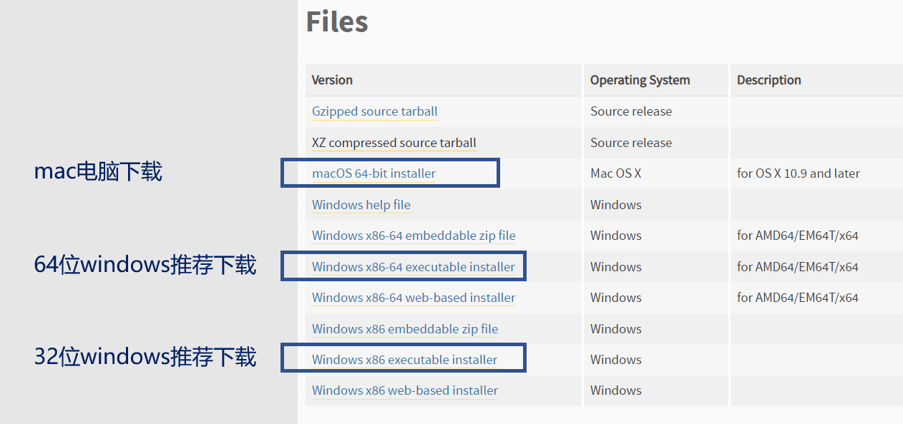

这里具体解释下
- windows X86-64是64版本，适合64位win系统
- windows X86是32版本，适合32位win系统
- executable installer是完整的下载包，比较大，但下载后可以直接安装（可离线）
- web-based installer比较小，但是下载后要联网完成安装。
- 推荐 executable installer

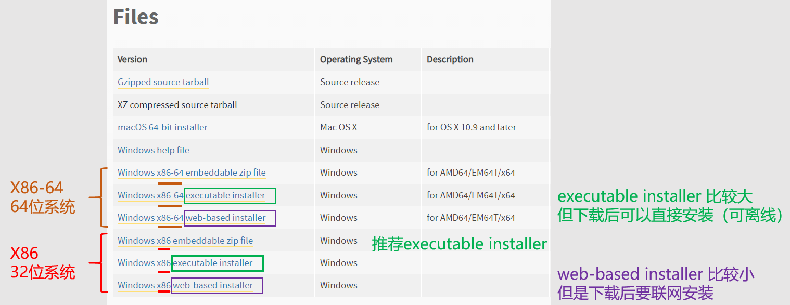

### 二 如何安装
#### windows电脑安装
1. 点击下载后的应用程序
我们这里是python-3.7.9-amd64
2. 勾选安装界面的Add Python3.7 to Path
3. 点击Install Now

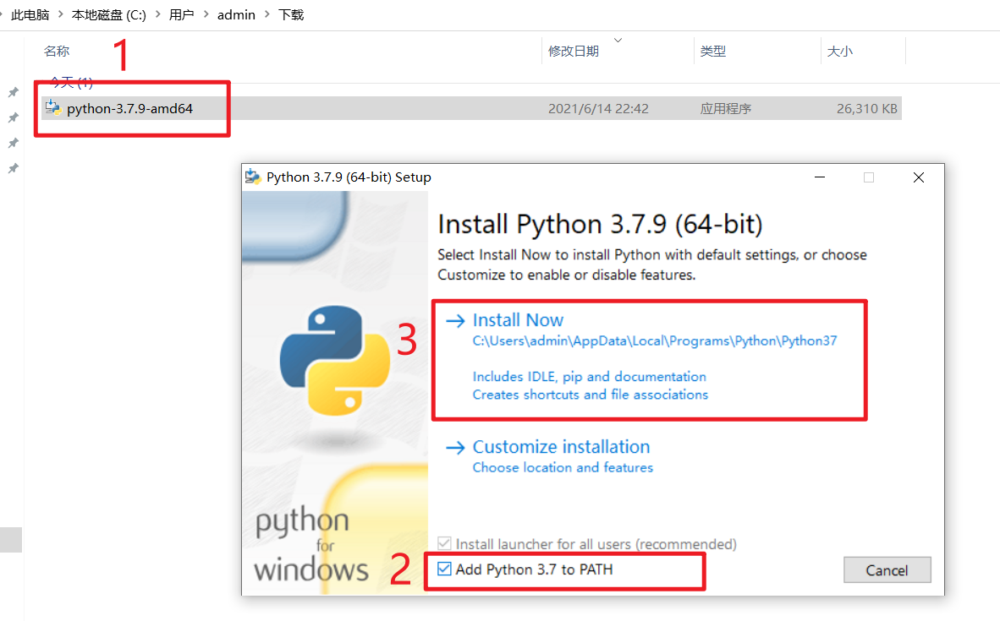

然后等待一会，就安装好了
安装完后界面如下

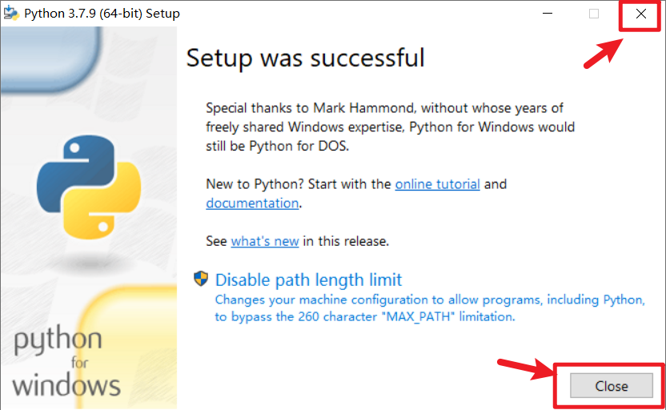

点击右上角的叉号或者右下角的Close，直接关闭就可以了。

**检查是否安装成功：**
1. 按win+R打开“运行”对话框，输入cmd，点击确定即可打开命令行
win键是(键盘左下角Ctrl和Alt之间的按键)

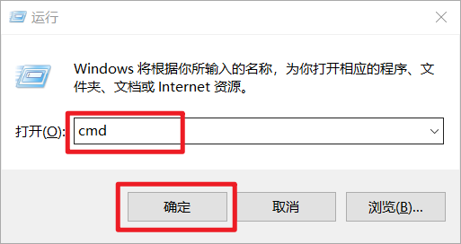

2. 在命令行中输入python并回车，出现如下图的python交互式命令行就代表安装成功

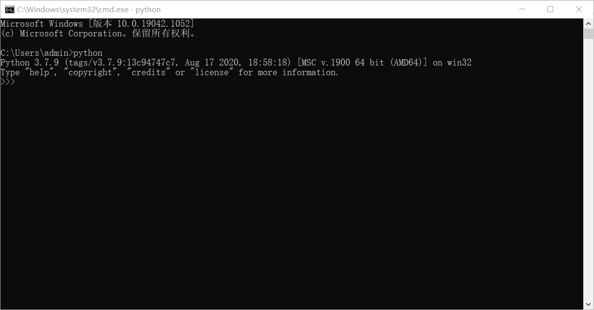

3. 最后在python交互式命令行中，
写一行代码纪念下，
这里我想写`print("Welcome, commander")`，
然后回车

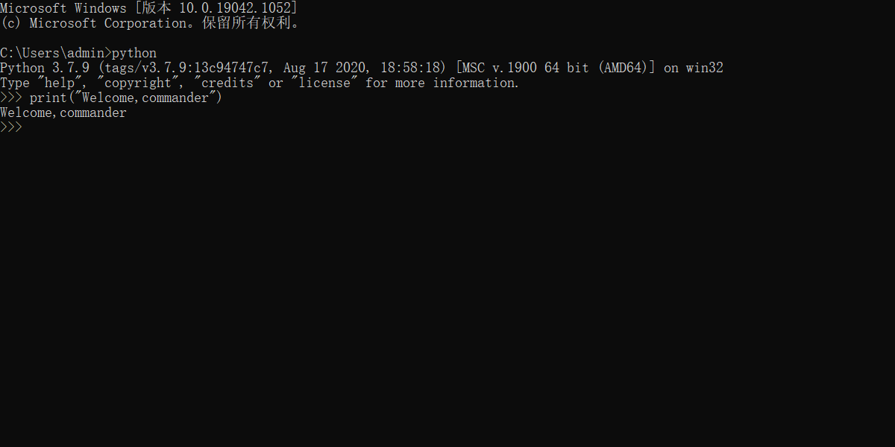

#### mac电脑安装
1. 点击下载后的应用程序
我们这里是python-3.7.9-macocx10.9.pkg
2. 安装界面的介绍，点击继续

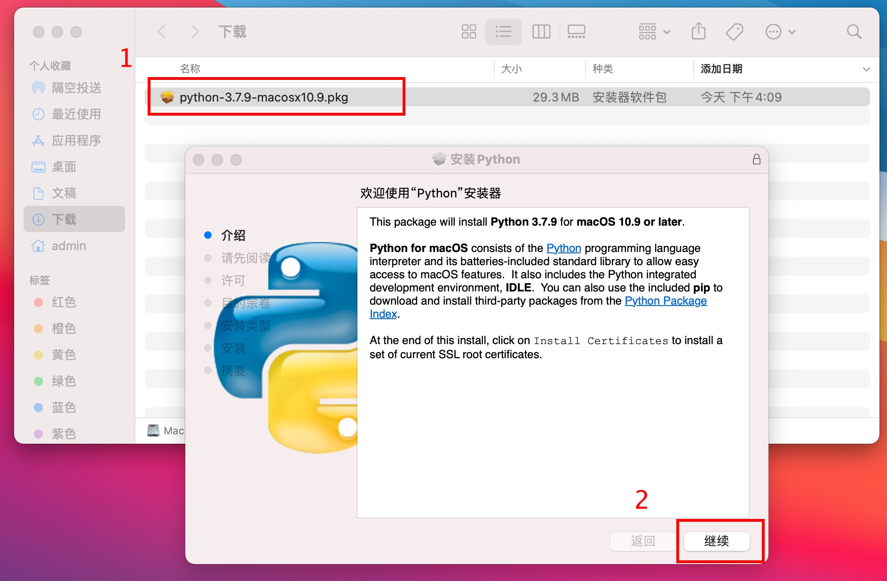

3. 安装界面的请先阅读，点击继续
4. 安装界面的许可，点击继续->同意
5. 安装界面的安装类型，点击安装
  然后输入密码或使用触控ID以允许此操作。
6. 开始安装，等待一会
7. 安装完毕，关闭安装界面

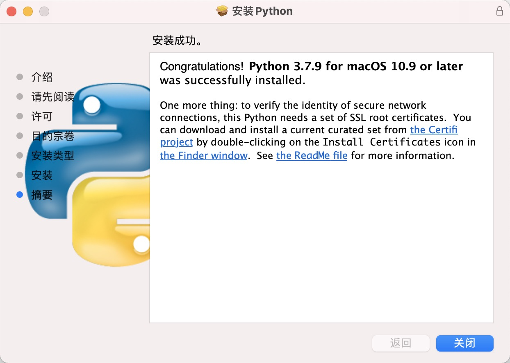

此时应用程序界面就会有python 的IDLE和Python Launcher

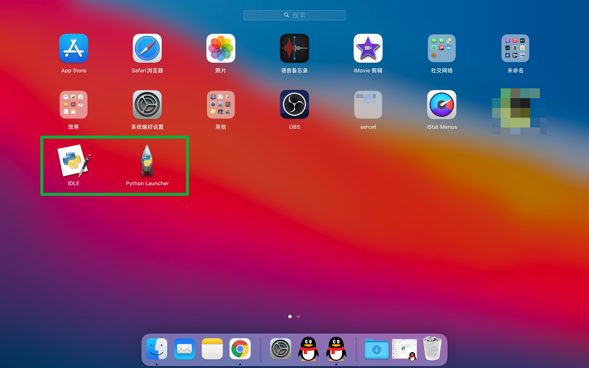

**检查是否安装成功：**
1. 打开mac的终端（一般位于启动台->其他->终端)

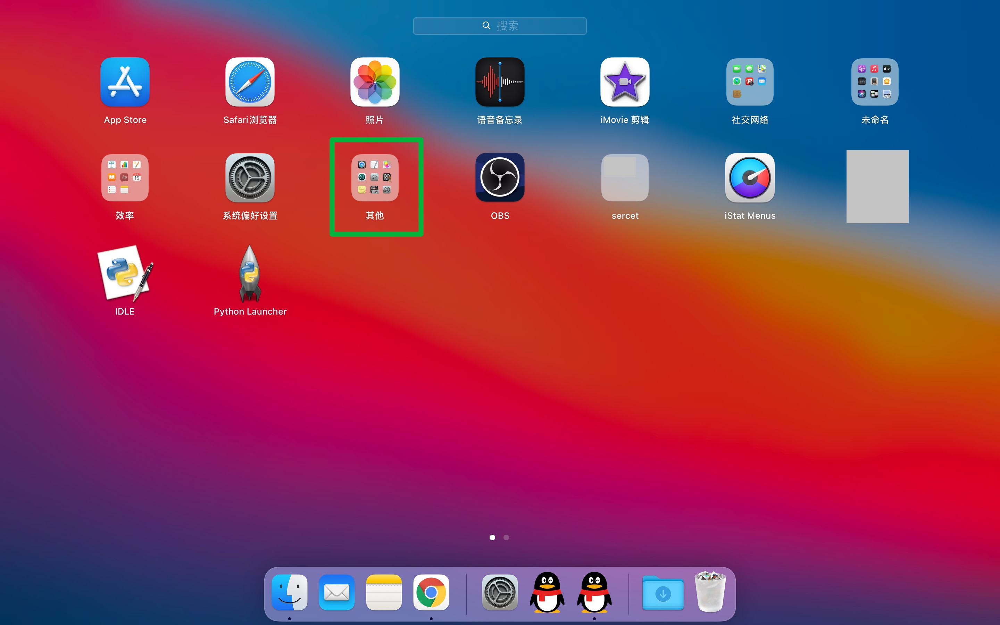
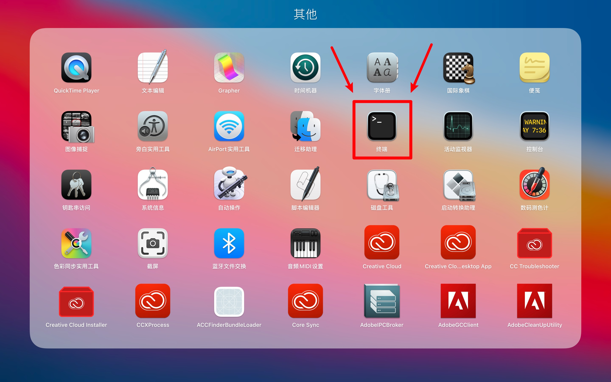

2. 在终端中输入python3并回车，出现如下图的python交互式命令行就代表安装成功

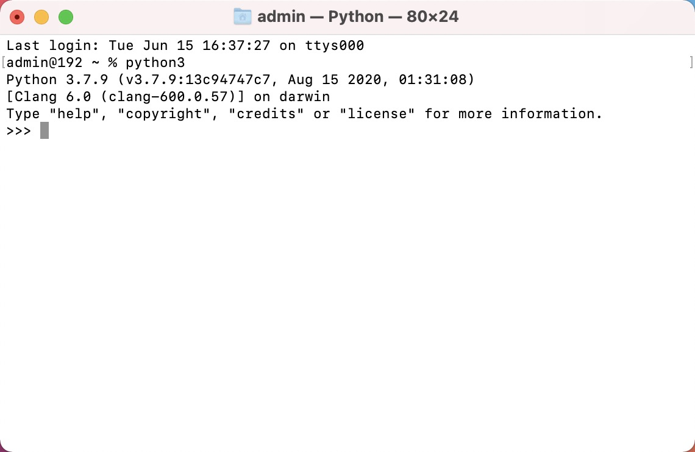

3. 最后在python交互式命令行中，
写一行代码纪念下，
这里我想写`print("Welcome, commander")`，
然后回车

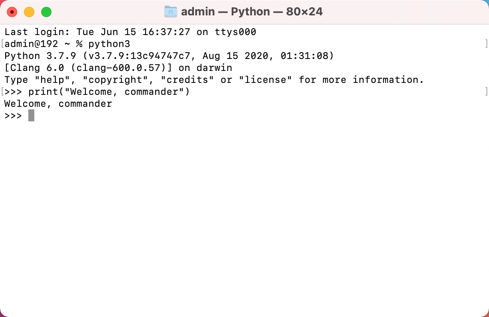
