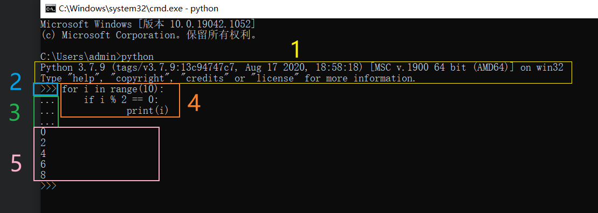
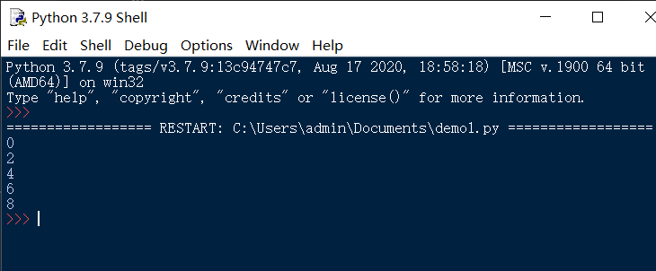

## 什么是IDE？python选什么IDE好？

### 一 感受IDE

什么是IDE？
在这里，我并不想直接给出一个回答，
因为这个回答对初学者来说，可能有些抽象。

我想先带大家感受下IDE。

#### 1 比较不同
首先是回顾，
在准备工作——第一小节的最后，
提到过在命令行/终端中输入python/python3并回车，进入python交互式命令行。

除了通过命令行/终端进入python交互式命令行。
我们还可以打开python IDLE(安装了python就有)

- windows打开方法如下图


- mac打开方法为启动台->python IDlE，如下图


这里比较下命令行/终端进入的python交互式命令行(左)，
和python IDLE的交互式命令行(右)。

推荐初学者把下面的代码在两种环境都跟着敲一遍
(目前并不需要理解代码的意思，但是可以感受一下敲代码的感觉)


对比敲代码的过程
- 会发现右边的会自动缩进，左边的需要自己手敲。
- 右边的敲到range、print的时候，会有提示(call tips)，如下图


观察敲完的结果
- 右边的代码有各种各样的颜色，
  术语叫代码高亮。

- windows上的话，这两个背景不同。
  实际上IDlE的背景色是可以调整的，
  或者说叫调整高亮主题样式。

> IDlE调整高亮主题样式方法：
> 在菜单栏Options -> Configure IDLE，
> 在出现的窗口中，点击Highlights面板，
> 点击IDlE Classic，选择IDLE Dark,
> 
> 就可以切换成黑暗主题，该主题效果
> 
> 除此之外，在左边还可以自定义高亮主题

除此之外，IDLE还有一些其他的功能，比如
- 自动补全，需要在菜单栏Edit点击Show Completions才
- 撤销，重做
- ...

同样是交互式命令行，IDlE的拥有更丰富的功能。

#### 2 认识交互式命令行

简单的介绍下python交互式命令行，
以下图为例



- 图中的代码大家不需要理解
- 1：欢迎信息(展示python的版本号等信息)
- 2：主提示符(提示输入代码)
- 3：次提示符(提示输入代码)
- 4：输入的python代码
- 5：运行4中的python代码的输出

主提示符(`>>>`)和次提示符(`...`)都只是交互式命令行中，提醒你输入python代码的提示符号。

这里强调一点。

**提示符不是python代码，python语法也不支持这个。**

网上各种python教程展示的代码，有时候是python交互式命令行的代码。

有一些初学者不知道这个，复制代码的时候，，把提示符也复制了，结果发现自己运行不了。
就是这个缘故。

正确的做法是删除提示符，
一般提示符和代码有个空格间隔，这个空格也要删掉。

> **这里说个可能会用到的小知识**
> 在命令行/终端进入python交互式命令行后，怎么退出python交互式命令行，重新回到命令行/终端？
> - 笨办法是关掉命令行/终端再打开
> - 执行这个python命令退出：`quit()`
> - 输入文件结束字符并回车：
>   windows的文件结束字符为ctrl+z
>   mac的文件结束字符为ctrl+d


#### 3 编写python文件
> 在交互式命令行中，我们只能运行一段代码。
> 而且每次要运行都要输入一次并回车，并不能把输入保存以供反复调用
(准确来讲，可以保存，但是保存后的不能调用执行)。
> python文件让我们能够编写多段代码，而且可以保存以供以后的反复调用。

**使用IDLE编写**

1. python IDLE菜单栏File->New File可以新建文件
2. ctrl+s即可保存，这里起名叫`demo1.py`,
其中py是python文件后缀名。
3. 添加代码，比如以下代码(可以手敲，也可以直接复制)
```python
for i in range(10):
    if i % 2 == 0:
        print(i)
```
4. ctrl+s保存(保存你对文件的修改)

其实，记事本也可以写python文件。
**使用记事本编写**
1. 右键新建->文本文档
2. 改名为`demo2.py`，资源管理器必须要是显示文件扩展名，设置方法如下


3. 使用记事本打开，添加代码，比如以下代码(可以手敲，也可以直接复制)
```python
for i in range(10):
    if i % 2 == 0:
        print(i)
```
4. ctrl+s保存(保存你对文件的修改)

#### 4 运行python文件
记事本虽然可以编写pyhon文件，但是记事本无法运行pyhon文件。

**命令行运行**
1. 在要执行的python文件目录处，
空白处shift+鼠标右键，
在此处打开PowerShell窗口


2. 输入`python demo2.py`并回车，就运行了`demo2.py`这个文件。


**使用IDLE运行**
相比之下，IDLE不仅可以编写python文件，还可以直接运行python文件。

1. 在IDLE编写完python文件并保存之后，记得不要关闭IDLE的窗口。
  如果你关闭了，则重新打开你之前写的python文件

2. IDLE菜单Run->Run Moudle，即可直接运行这个python文件


3. 运行效果如下图



事实上，IDLE不仅可以运行python文件，还可以调试（Debug）。

### 二 认识IDE与常用python IDE介绍

#### 1 认识IDE

通过第一部分的演示，
应该能够认识到：
在开发代码的过程中，
我们首先需要写代码，然后是运行代码，
以后还需要调试代码(debug)。

一款能让我们写代码，运行代码，调试代码的软件，就是IDE。

IDE是Integrated Development Environment的缩写，
其翻译为集成开发环境。
一般包括以下工具：
- 代码编辑器(写代码)
- 编译器(运行代码)、
- 调试器(调试代码)
- 图形用户界面
- 等等

> 参考：[百度百科——IDE](https://baike.baidu.com/item/%E9%9B%86%E6%88%90%E5%BC%80%E5%8F%91%E7%8E%AF%E5%A2%83/298524)

同时对于每一种工具，IDE还会实现各种各样的功能以提高开发效率。

好的IDE能给我们带来极大的助力。

可以说，
**IDE选的好，项目都比别人完成的早，BUG还比别人少。**

#### 2 常用python IDE介绍
事实上，python自带的IDLE就是一个IDE。

IDLE的全名为Integrated Development and Learning Environment.
意思是说，自己是集成开发与学习环境。

但IDLE功能是比较有限的，
我们往往还需要安装功能更丰富的IDE来提高我们的开发效率与体验。

常用的python IDE有很多，
我这里只列举几个我用过的吧
- [subline text](https://www.sublimetext.com/)
- [atom](https://atom.io/)
- [vs code](https://code.visualstudio.com/)
- [pycharm](https://www.jetbrains.com/pycharm/)

这些IDE和IDLE相比，有更多的设置选择，有丰富的主题样式，还有丰富的插件。

这里只做一些基础的比较。
- 更丰富的界面信息。
以Atom为例，左侧边栏能展示项目结构，右侧边栏（安装了插件后）能展示文档结构


- 代码编辑能进行更丰富的展示。
  比如行号信息，当前编辑行，缩进关系。


- 甚至还可以同时展示多个文件


### 三 IDE比较与选择
本节课将会选择Atom和Pycharm这两款IDE。

#### 1 比较

个人看重的IDE的核心比较点有以下几点
- 速度
- 功能丰富度
- 运行需要的内存(带不动就会卡顿)

一般来讲，功能越多的启动速度越慢，运行消耗的内存越大。

我之前罗列的四款IDE，
个人使用体验如下(不安装太多插件的情况下，写python代码的体验):

**速度**：Subline text > Atom > Vs code > Pycharm

**功能**：Pycharm > Vs code > Atom = Subline text

**内存**：Pycharm > Vs code > Atom > Subline text

补充说明：同一IDE，安装的插件越多，功能会越多，但速度也会越慢。

#### 2 选择原则——一轻一重

一般来讲，速度快的，占用内存小的，称为轻量级IDE。

占用内存大的，速度慢的，称为重量级IDE。

（个人体验）轻重对比如下(左轻右重):
Subline text < Atom < Vs code < Pycharm

轻量级，重量级，我并没有查到一个明确的标准。
在这四款软件的官网上，并没有找到对自生量级的描述。
查阅一些其他的博客或教程，都说前三个是轻量级，Pycharm是重量级。

> 但我个人认为Vs code算是中量级，
> 我不觉得这个玩意轻(也有可能是安装了比较多的插件的缘故)。。。

轻量级IDE轻便快捷，适合一些简单场景，
比如只是要看单个文件甚至几行代码，做一点微小的改动，以及不希望太占用系统内存。

重量级IDE适合开发大型项目，效率更高，体验也更好。


这里推荐大家轻量级IDE和重量级IDE都安装一款，
以满足平时的不同使用需求。

#### 3 轻选Atom

这里面最轻的就是subline text， 但是我为什么不选subline text而选atom呢？

其实subline text比atom速度更快。
比较启动软件的速度，subline text几乎瞬间打开，
atom还会有几秒的明显的等待。

但是subline text是闭源收费的，大家下的免费版本理论上是试用版，每保存文件达到一定次数，都会弹窗提醒你购买。
虽然可以关了弹窗继续用，我有点强迫症，很反感弹窗，尤其是开发大型项目要保存的文件多的时候，弹窗频率很高。

#### 4 重选Pycharm

其实vs code的功能也非常丰富，个人认为，功能上可以算得上是重量级了。

所以其实vs code和Pycharm还可以比一比。

如果你是只学python或者说主要是学python，推荐使用Pycharm。

如果你学很多语言，python只是其中一门，比如这学期选了很多编程课，python只是之一，那么推荐vs code。
