## 安装Atom与配置Python环境

> 安装轻量级IDE——Atom

### 一 下载
> 下面步骤1，2中网络卡顿的朋友，
> 请直接查看步骤3来操作

1. 使用搜索引擎搜索Atom，
  打开搜索到的[Atom官网](https://atom.io/)

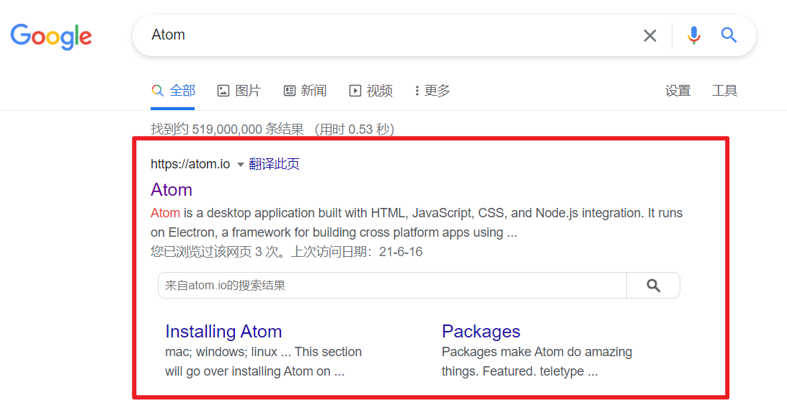

2. 在Atom官网，直接点击右侧的黄色Download按钮下载就好。
  Atom官网会自动检查你的系统，自动为你推荐合适的下载版本。

windows访问Atom官网效果:

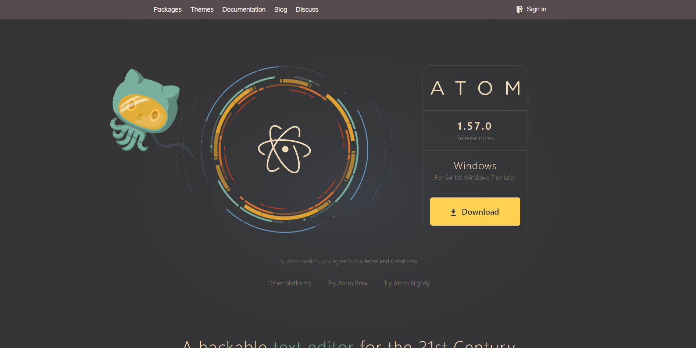

mac访问Atom官网效果:

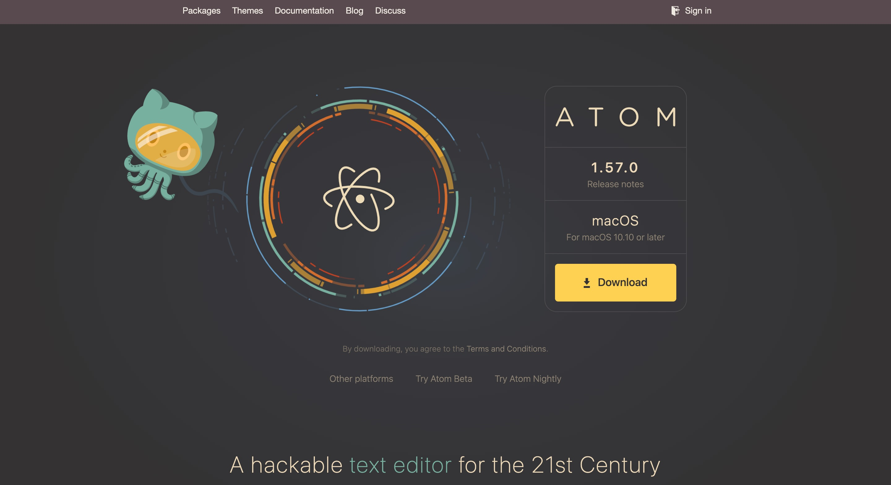

3. 从官网粘贴的下载地址。
  点击即可使用浏览器开始下载，如果觉得浏览器下载太慢，推荐复制链接到迅雷下载。
- 64-bit Windows: [https://atom.io/download/windows_x64](https://atom.io/download/windows_x64)
- 32-bit Windows : [https://atom.io/download/windows](https://atom.io/download/windows)
- macOS: [https://atom.io/download/mac
](https://atom.io/download/mac)

### 二 安装
#### windows 安装
1. 打开下载到的AtomSetup-x64.exe(32位系统下载的是AtomSetup.exe)

2. 等待安装(等待界面如下图)


3. 安装完成后，会自动打开Atom，如下图。

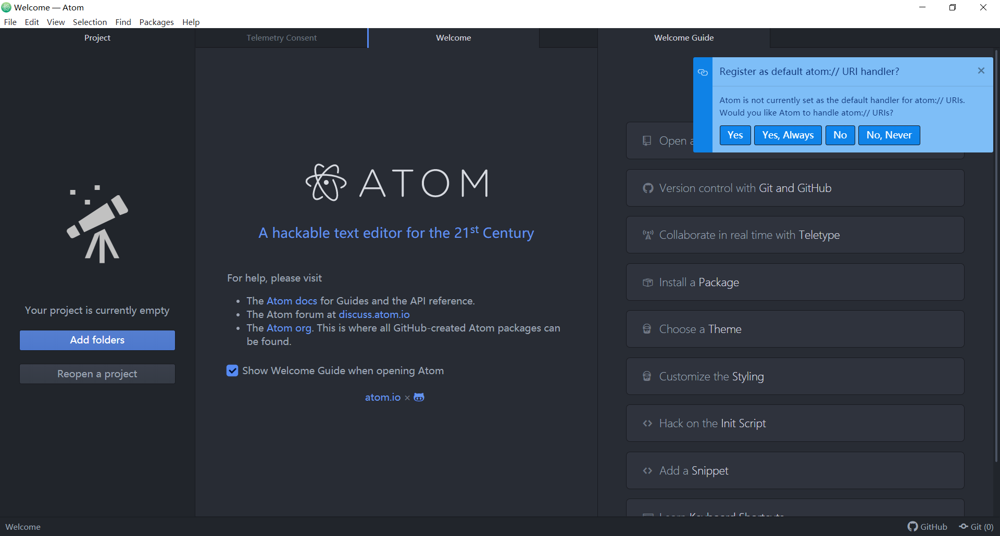

#### mac 安装
1. 打开下载到的atom-mac.zip, 即可解压得到Atom应用程序

2. 推荐将Atom应用程序从下载文件夹移到应用程序文件夹，

3. 打开Atom应用程序，
  mac会弹窗拦截，在拦截弹窗中点击打开,
  即可直接打开Atom。

### 三 基础设置
#### 0 Atom软件打开后的设置

**关闭各种窗口**

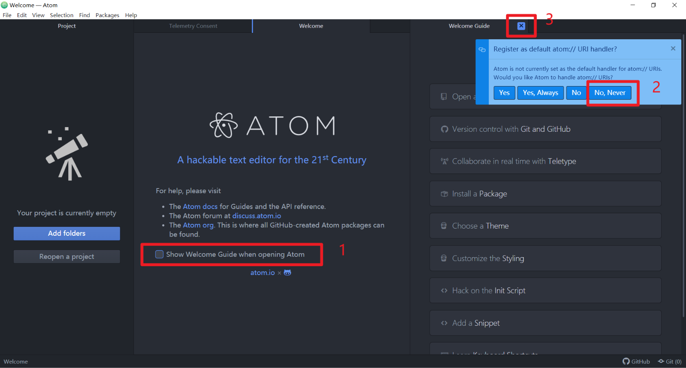

按照图中步骤
1. 不勾选`Show Welcome Guide when opening Atom`
2. 右上角弹窗选择`No, Never`
3. 关闭`Welcome Guide`页面和`Welcome`页面

**Telemetry Consent**

这个页面是询问你是否把自己的使用数据匿名发给Atom团队。

比较介意或者信不过Atom团队推荐选择No。

我觉得问题不大，所以我选Yes。

#### 1 打开设置面板方法
- windows上，点击菜单栏File->Setting 打开
- mac上，点击菜单栏Atom->Preferences

设置界面效果如下

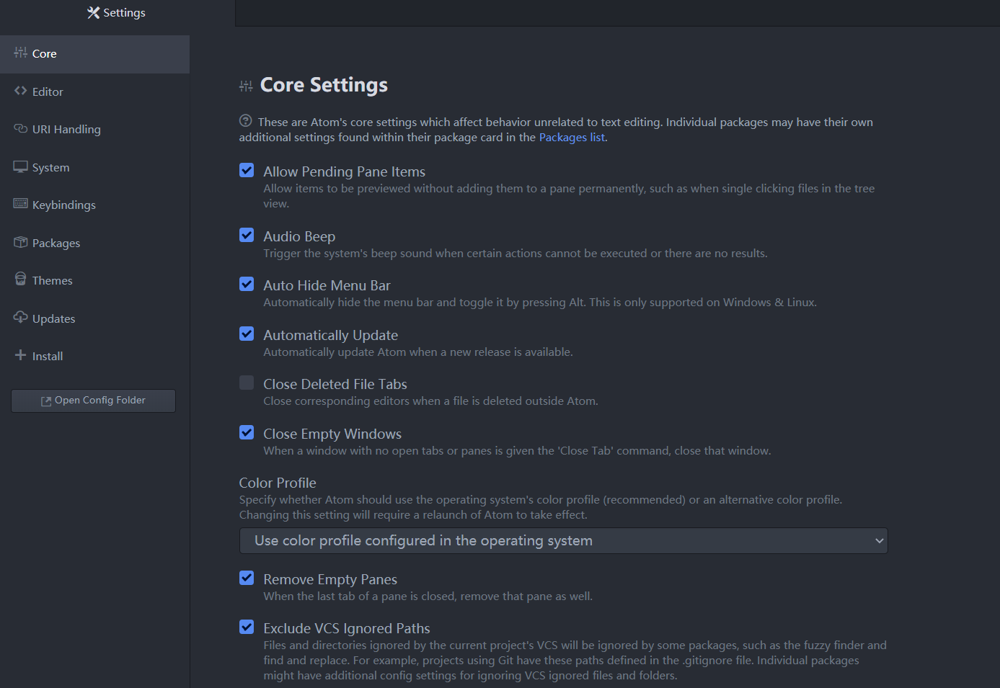

#### 2 设置缩进提示
在设置界面点击Editor面板,
勾选show Indent Guide

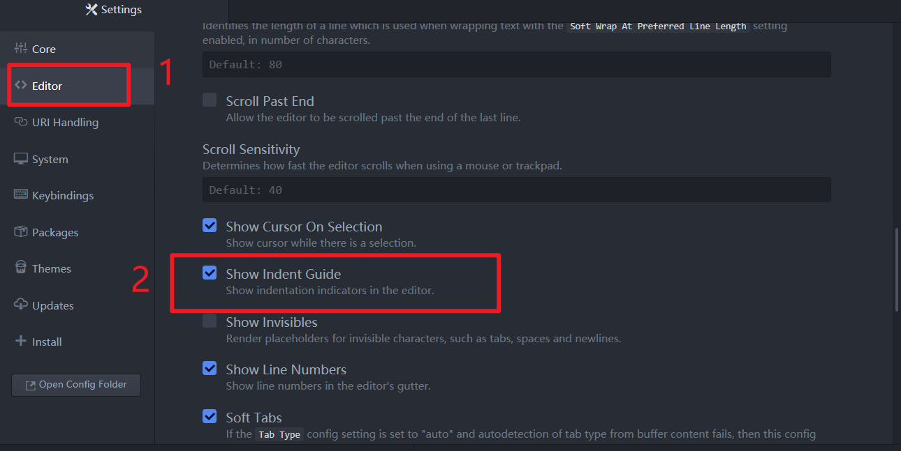

不勾选(左)与勾选效果(右)对比

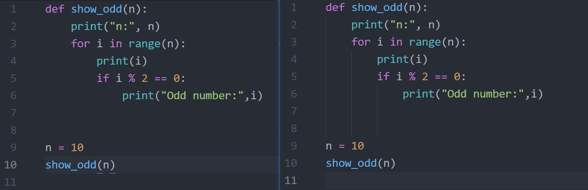


#### 3 设置Tab缩进长度
设置界面Editor面板中
设置Tab Length为4

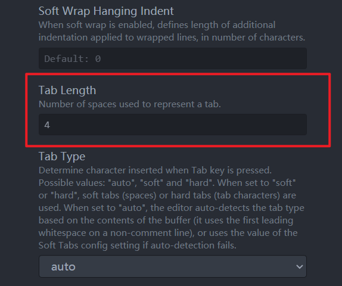

### 三 配置Package的方法
> Atom有很多功能强大的Package，实现了各种各样的功能。
> 想要使用这些功能，我们需要安装Packege
> Package: 功能包，插件

#### 1 设置镜像
> 由于Atom的package是在境外服务器下的，
> 境内的访问和下载都非常的慢。
> 境内的朋友可以使用国内的镜像源来下载。

> 参考: [设置Atom的包管理器——apm的代理](https://ayase.moe/2017/03/11/proxy-setting-of-apm/)

**说明：**
- windows请在命令行中运行下面的命令
- mac请在终端中运行下面的命令
> 怎么启动命令行 / 终端，请查看本系列教程:
> 准备工作——第一节中 ->
> 第二部分 ->
> 检查是否安装成功

设置apm使用的软件源的命令为
```shell
apm config set registry npm_mirror_url
```
其中`npm_mirror_url`为要使用的镜像源url，
即不能直接写npm_mirror_url来运行，要用镜像源url替换

> 常用的镜像源:
> 淘宝源: [http://registry.npm.taobao.org/](http://registry.npm.taobao.org/)
> CNPM: [http://r.cnpmjs.org](http://r.cnpmjs.org)

我这里使用CNPM
所以命令为
```shell
apm config set registry http://registry.npm.taobao.org/
```

测试是否设置成功：
```shell
apm install --check
```
看到输出
```txt
Checking for native build tools done
```
应该就好了

> **方法2(也可以用来对比检查)：**
> 1. 打开设置页面
> 2. 点击设置页面左侧面板最下面的`Open Config Folder`,
   会打开`.atom`项目
> 3. 点击打开`.atom`项目的`.apmrc`文件，添加如下命令后，保存关闭
> ```txt
> registry=http://registry.npm.taobao.org/
> ```

#### 2 安装Package的方法

打开设置面板，
点击设置面板的Install,
在右侧Install Packages下面的输入框中输入自己需要的Package的名字,比如`atom-runner`,
然后点击对应的Install

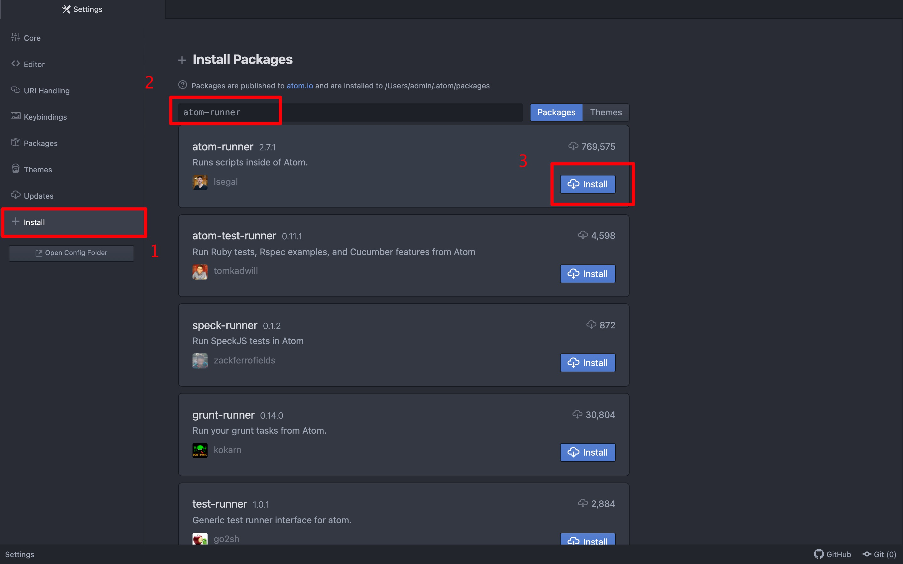

安装好后效果如下图。
如果需要进一步设置，可以点击红框里面的Setting
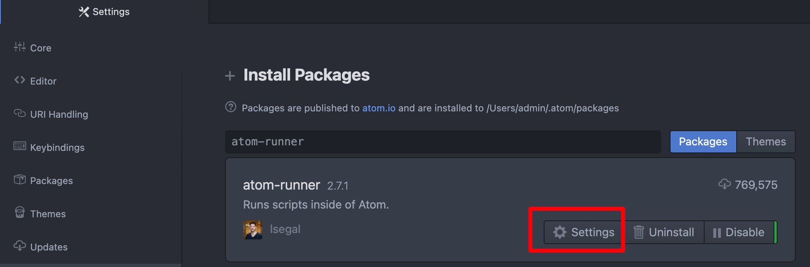


### 四 课程推荐安装的Package

#### atom-runner
> 本系列课程，目前推荐先只安装`atom-runner`。
> 虽然还有些其他Package功能很强大，但是安装起来略微有一些麻烦，比如依赖第三方库。
> 所以我们放到以后再拓展。

按照步骤三安装好`atom-runner`后，

**如果电脑上既有python2x，又有python3x的话，还需要再设置下。**
**一般来讲，mac上需要，windows上不需要。**

> 具体判断办法是，打开命令行/终端
> 如果输入python，看到的python交互式命令行版本为python3x，就不需要设置。
> 如果输入python，看到的python版本为python2x，此时输入python3，看到的python版本将为python3x，就需要设置。

首先打开config.cson
- windows 点击菜单栏File -> Config
- mac 点击菜单栏Atom -> Config

在config.cson末尾添加：
```cson
  "runner":
    "scopes":
      "python": "python3"
```
添加后效果如下

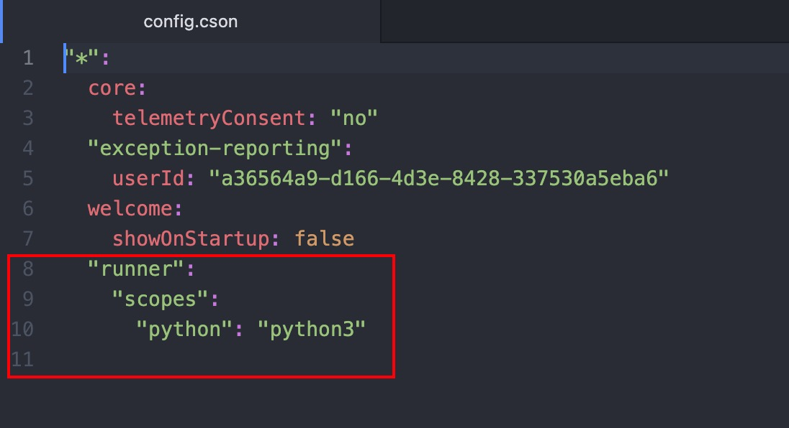

设置好后，重启Atom就可以运行python文件
- windows 按 `Alt+r` 来运行
- mac 按`Control+r`来运行

运行示例：

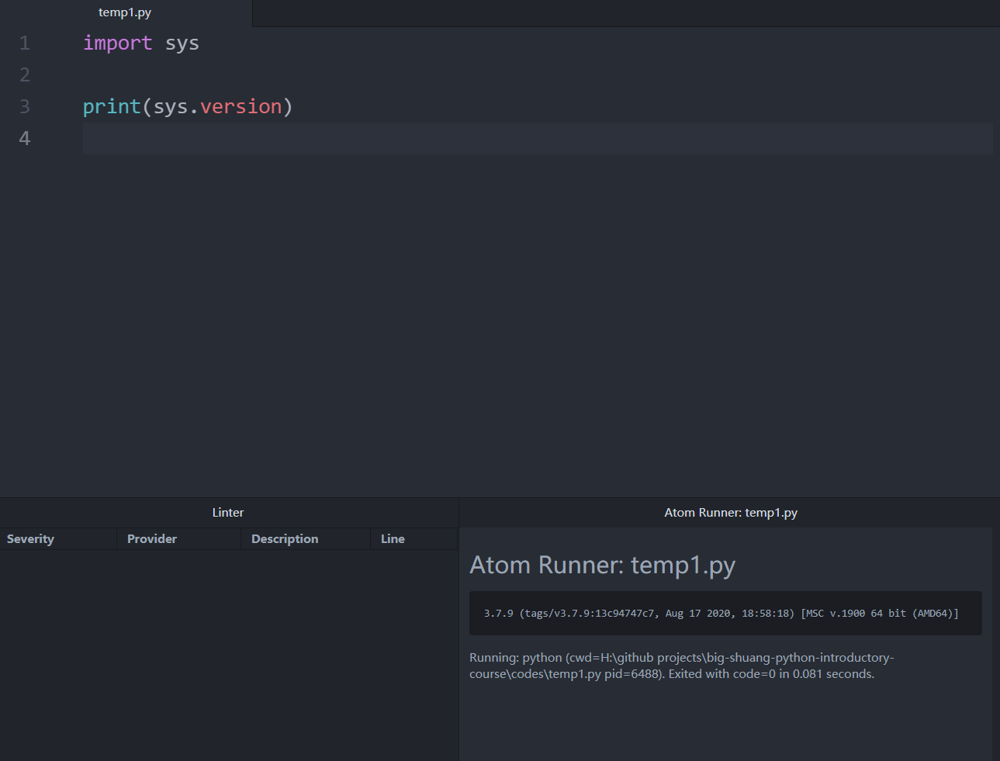

### 五 个人喜欢的Package
> 以下Package本课程并不确定需要，
只是我个人平时工作常会用到的,
记录在这里，感兴趣的话可以安装。

#### markdown-preview-enhanced

官网: [markdown-preview-enhanced](https://github.com/shd101wyy/markdown-preview-enhanced)

预览markdown文档，支持滚动同步，浏览器中打开等。

markdown-preview-enhanced设置页面，
Preview Theme选择atom-dark.css

预览快捷键: ctrl-shift-m

#### document-outline
> Displays a hierarchical, interactive outline tree view for document markup.

> 简易理解：显示文档目录。

官网: [document-outline](https://atom.io/packages/document-outline)

主要是用来展示markdown文档的目录大纲。

目前(2021/6/17)并不支持展示python代码大纲


#### 效果
这两个的效果如下图

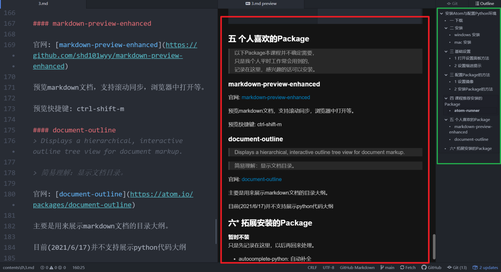

- 红框中展示的是markdown-preview-enhanced的效果

- 绿框中展示的是document-outline的效果

### 六* 拓展安装的Package
**暂时不装**
只是先记录在这里，以后再回来处理。
- autocomplete-python: 自动补全
- linter-flake8: 语法检查
- python-tools: 定义/使用跳转
