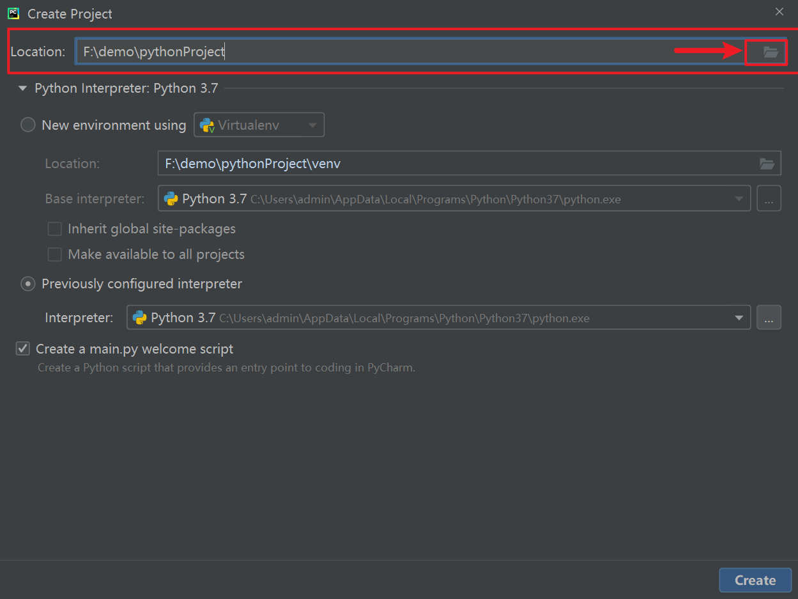
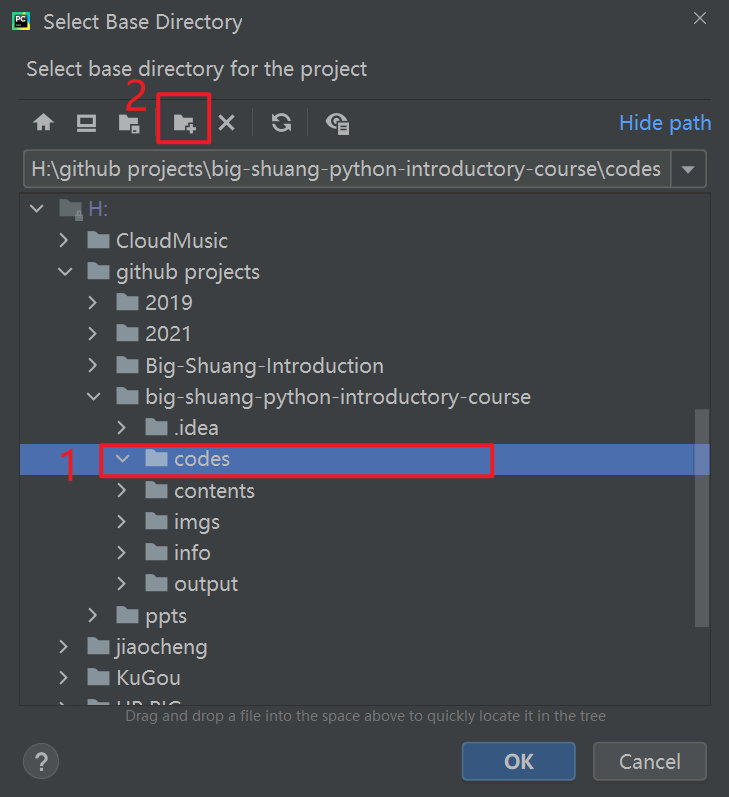
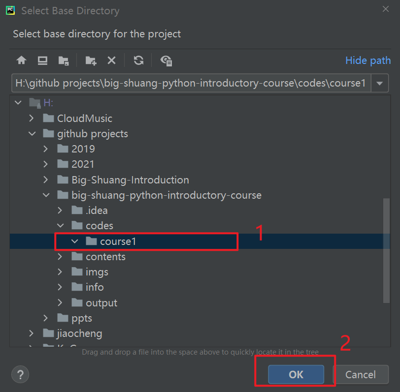
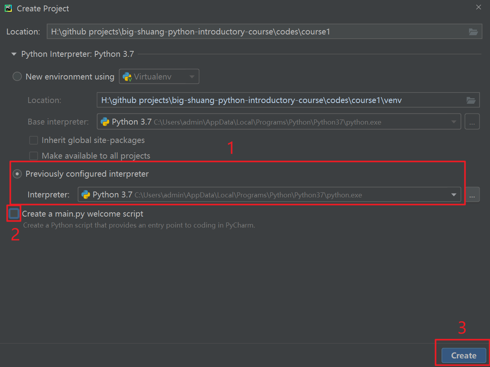
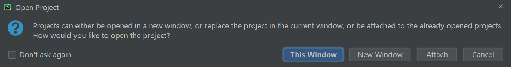
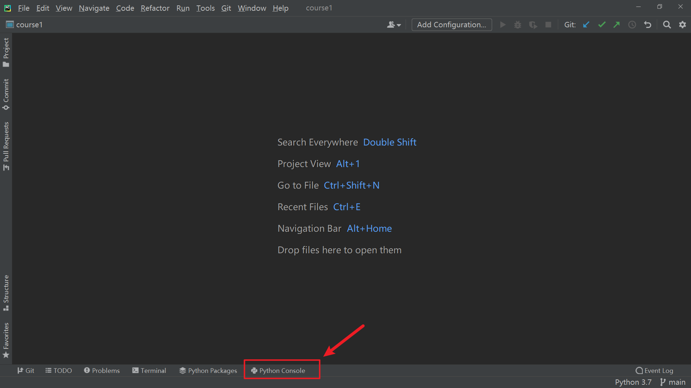
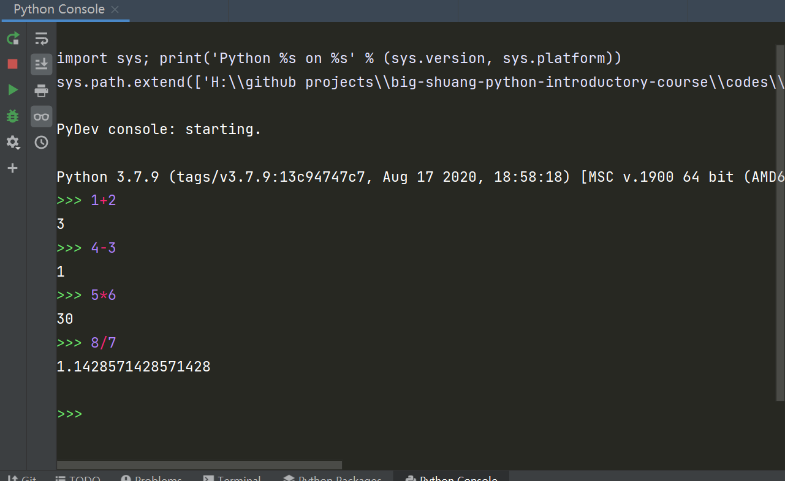

## 简单的数学运算

### 1 使用pycharm建立我们的第一个项目

1. 打开pycharm，点击菜单栏，File->New Project
2. 在Location(项目地址)那一行，点击右侧的图标打开地址选择界面



3. 挑一个自己觉得合适的文件夹，比如我挑了codes文件夹，点击新建文件夹图标(红框2)



4. 在弹出的文件夹名称设置窗口中，输入`course1`，点击回车。

5. 再选择新建的`course1`文件夹，点击ok



6. 再在Python Interpreter这里，
   选择下面的Previously configured interpreter(红框1)
   不勾选Create a main.py welcome script(红框2)
   点击Create(红框3)



7. 如果出现如下窗口的话，点击`This Window`



> 这个窗口是询问你，
> 是在当前Pycharm窗口打开这个新项目(当前窗口中的老项目将被关掉)？
> 还是新建窗口打开新项目?

### 2. 基础的计算
> 第一章，将从大家最容易理解的数的计算开始，
> 带领大家熟悉python。
> 而Python 的交互式命令行，非常适合展示各种基础的计算

> 点击Pycharm界面底部的Python Console，
> 打开Pycharm中的交互式命令行。
> 

#### 基本运算符
首先，我们看下基础的加减乘除的运算(如下图)



在python中， 四种基本运算符对应的符号如下
- 加： `+`
- 减： `-`
- 乘： `*`
- 除： `/`


#### 常用运算符
除了这四种基本运算，常用的运算符还有
- 取整除(地板除法，只取商的整数部分): `//`
- 取余: `%`
- 幂: `**`
  `x**y`: x的y次方

> 补充：由于表达习惯，很多人将 `//`叫做整除。
> 严格来讲，这是不对的，因为整除应该是一种关系，按照定义只有能整除和不能整除两种情况。
> 我个人以前也有这个表达错误，也是这回做教程，求严谨仔细查了后才发现。
> 但是由于很多人都这么叫，且这么称呼确实符合口语习惯，严谨的说法反而很绕口，不好理解。
> 再加上把整除解释为整数除法，勉强也能说过去。
> 所以大家把这个叫做整除也可以。
> 只不过，我个人在教程里会尽可能用严谨的说法。
> 由于习惯，也不排除口误。

```python
>>> 10 // 3  # 10除以3的整数商
3
>>> 10 % 3  # 10除以3的余
1
>>> 2 // 3  # 2除以3的整数商
0
>>> 2 % 3  # 2除以3的余
2
>>> 2 ** 3  # 2 的 3 次方 = 2 * 2 * 2
8
>>> 3 ** 2  # 3 的 2 次方 = 3 * 3
9
```

#### 常用的场景

光知道了运算符是不够的，
关键是要理解运算符使用的场景。

看懂不代表会了，在需要用的时候能想到，才算会。

其他运算符的使用场景大家应该都很熟悉，都能反应过来
但是求整数商`//`，取余`%`的使用场景
可能有的朋友就不是很熟悉了。

那么这里举一个例子。
有6个同学，每天一个人，轮流做卫生。

**请问：第100天的时候该是，第几个同学做卫生？**
**第100天结束时，这个同学已经做了多少次卫生？**

答案是

- 第几个：`100 % 6`，结果是`4`
- 多少次：`100 // 6`，结果是`16`

**结论：**
这种轮流的，循环的场景中，计算次数和次序的，
往往要使用到，求整数商`//`，取余`%`。

请不要死记硬背，一定要理解。

#### 运算优先级
大家都知道，数学运算是有优先级的，
python里的运算符也是有优先级的。

先举个大家都能理解的例子
```python
>>> 1 + 2 + 3  # 从左往右
6
>>> 1 + 2 * 3  # 先算乘，再算加
7
>>> (1 + 2) * 3  # 想要先让1+2，就要用括号
9
```

有的朋友可能会觉得这个例子很简单，
那是因为
1. 大家都知道乘除法的优先级高于加减法。
2. 加减乘除的优先级只有两层。

觉得简单的朋友们不妨猜一猜

- `2*3**2`
- `2**3*2`
- `2**2**3`

都是多少

答案是: 不要猜

**老老实实用括号括起来**
- `2*(3**2)`
- `(2**3)*2`
- `2**(2**3)`

> 以下为拓展内容，不必掌握，可以跳过。
> 当然，可能有的朋友非要去探究一下，
> 或者根据左右边对应关系猜出结果：
> - 幂运算优先级高于乘法运算
> - 幂运算是从右往左的(估计很多朋友第一次遇到这种从右往左的)
> 补充：这两个不必掌握，就算你掌握了，也老老实实用括号写，方便看懂。

不推荐初学者一上来就过于深入的探究运算优先级。
因为python运算符优先级共有十几级，然后又分从左往右和从右往左的运算。
这个东西多讲几下，估计初学者就要直接从入门到放弃了。

目前只用掌握基本的就可以了，
即知道`*,/,//,%,**`运算优先级都高于加减法就够了
`*,/,//,%,**`之间的运算优先级不用掌握。

除此之外，一律使用括号括起来。
这样不仅你好写，别人也方便看懂。

### 3 赋值

介绍完常用的算术运算符，
接下来给大家介绍下python里面的赋值运算符：`=`

**注意：这个等号不能理解为等于，要理解为赋值。**
这里用的确实是数学中的等号，但是意思变了。

`=`左边是一个变量名，
`=`把右边的计算的值，赋值给左边。

举个例子：
```python
>>> x = 1
>>> x = x + 1
>>> x
2
```

- `x = 1`，是把1赋值给变量`x`
- `x = x + 1`，是把`x + 1`的值(也就是2)，赋值给变量`x`

第二个式子，如果按照等于来理解`=`，那就无法理解。

大家理解了赋值，下面的例子想必就不难看懂了
```python
>>> x = 1
>>> x = x + 1
>>> x
2
>>> x = x * 2
>>> x
4
>>> x = x * 2
>>> x
8
>>> x = (x + 1) / 3
>>> x
3
```

每一个变量在使用前都要先赋值定义，否则会报错。
举例如下
```python
>>> x = z + 1
Traceback (most recent call last):
  File "<pyshell#3>", line 1, in <module>
    x = z + 1
NameError: name 'z' is not defined
```
`name 'z' is not defined`这个报错，是说这个变量没有被定义（没有被赋值）。
大家以后看到`name '某某某' is not defined`的时候，要先去检查下这个变量是否被赋值过。

**赋值简写**
接下来补充一个非常常用的小技巧，
有些常用的赋值写法是可以被简写的，
- `x = x + 1`可以简写为`x += 1`，
- `x = x - 1`可以简写为`x -= 1`

`+=`, `-=`非常常用，如果不会用，起码遇到要能看懂。

除此之外，常用的还有下面的简写，能看懂就行(下面两种简写我个人用的不多)
- `x = x * 2`可以简写为`x *= 2`，
- `x = x / 2`可以简写为`x /= 2`

> 补充，实际上`+=`,`-=`,`*=`,`/=`都算赋值运算符。

### 4 一元运算符

数有正数负数之分，我们一般用`+`, `-`号来表示正与负。
python里面也用`+`, `-`来表示正与负，
而且符合大家了解的基础知识：正数前面的`+`可以省略，负负得正。
举例如下
```python
>>> +5
5
>>> -3
-3
>>> x = 5
>>> x = +x
>>> x
5
>>> x = -x
>>> x
-5
>>> x = +x
>>> x
-5
>>> x = -x
>>> x
5
```

**上面例子中的`+`, `-`是一元正负运算符，**
**逻辑上，不再是上面基础运算中的加减运算了。**

- 一元运算符，只运算一个数据，比如`+1`, `-5`
- 二元运算符，运算两个数据，比如`1 + 1`, `6 - 5`


### 5 细节补充
#### 空格
细心的朋友可能会注意到，我上面代码很多地方都留有空格。
比如`x = 1`，等号两边留有空格，实际写成`x=1`程序也能正常运行。
这里的空格加不加都不会影响程序的正常运行，主要是为了增强代码的可读性(更好看)。

不过空格不要乱加，要遵循对应的规范。
python的官方编码规范为[PEP 8](https://www.python.org/dev/peps/pep-0008/)

这个东西太多，目前只用知道，
**二元运算符两侧要加空格。**
(一元运算符不要加)

或者通俗一点讲，运算符要连接两个东西的时候，就要用空格隔一下，看起来不至于太挤，更重要的是方便区分。

比如大家比较这两个(结果都是7)
- `12+-5`
- `12 + -5`

当然，这只是一个软规则(不影响程序具体运行)，初学者把握不住也没关系，以后多观察多模范就好。

再补充一个硬规则：
**每行代码开头不要乱加空格。**
这个加错了程序会报错。
具体未来我们学到涉及缩进的内容会讲。


#### 赋值后的变化
```python
>>> x = 2
>>> y = x
>>> y
2
>>> x = 5
>>> x
5
>>> y
2
```

第二行，把x赋值给y，
是把x的值赋值给了y，
之后x进行别的赋值，对y不会影响。

#### 代码文件
> Python交互式命令行与python文件对比

我们上面展示的都是在交互式命令行中的可以运行的代码。
如果在文件中写代码，还会有一点不同，

交互式命令行中，单个表达式或变量，
交互式命令行会自动把其结果输出展示出来。

python文件中则不会自动展示，
想要把结果在控制台输出展示，要使用`print()`方法。

比如下面的python文件
```python
12 + 5 + 1
x = 12
x
y = 20
print("Use print")
print(y)
```
运行后输出如下
```txt
Use print
20
```
只有第5，6行输出了结果。
第1，3行不会输出。

像第1，3行的语句在代码中虽然能正常运行，但是不会产生任何效果，属于无用的语句。
