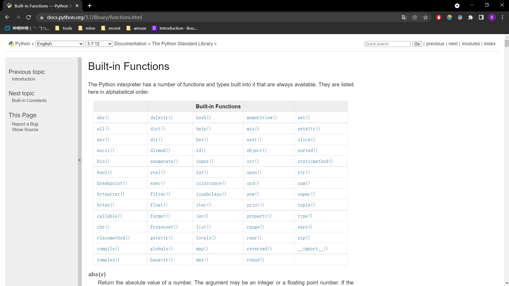
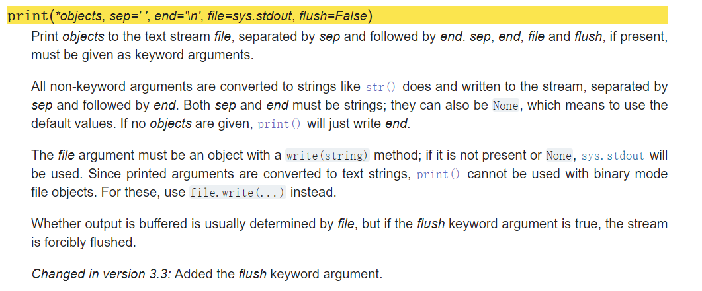

## 深入了解`print`

> 以`print`为例，认识函数。
> 学习读懂函数的过程。

### 1 内置函数
现在，让我们再来详细认识下`print`这个函数。
`print`属于内置函数，`built-in functions`。

内置函数的官方文档为 [Built-in Functions](https://docs.python.org/3.7/library/functions.html)

如下图所示


在其中，点击`print`函数链接，跳转到`print`对应的说明。
截图如下


### 2 试读`print`官方文档
先尝试读下官方文档。
这里我们一句一句来读。
首先是函数声明，
> `print(*objects, sep=' ', end='\n', file=sys.stdout, flush=False)`

先初步解读下这些形参
- `*objects`: 接受不定数量的参数。
- `sep=' '`: `sep`默认值为`' '`
- `end='\n'`: `end`默认值为`'\n'`
- `file=sys.stdout`: `sep`默认值为`sys.stdout`
- `flush=False`: `flush`默认值为`False`

然后继续往下
> Print `objects` to the text stream `file`, separated by `sep` and followed by `end`.
>  sep, end, file and flush, if present, must be given as keyword arguments.

将`objects`打印到文本流`file`中，使用`sep`来分割，最后接`end`。
如果存在`sep`、`end`、`file`或`flush`, 必须使用关键字参数来传参。

> All non-keyword arguments are converted to strings like `str()`` does and written to the stream, separated by `sep` and followed by `end`.
> Both `sep` and `end` must be strings; they can also be `None`, which means to use the default values.
> If no `objects` are given, `print()` will just write `end`.

所有非关键字参数(即位置参数)，都会使用`str()`方法转换为字符串并写入流，使用`sep`来分割，最后接`end`。
`sep`和`end`都必须是字符串；它们也可以是`None`，这意味着使用默认值。
如果没有传入`objects`，`print()` 将只输出`end`。

> The `file` argument must be an object with a `write(string)` method; if it is not present or `None`, `sys.stdout` will be used.
> Since printed arguments are converted to text strings, `print()` cannot be used with binary mode file objects.
> For these, use `file.write(...)` instead.

`file`参数必须是具有 `write(string)`方法的对象； 如果它不存在或无，将使用 `sys.stdout`。
由于打印的参数被转换为文本字符串，`print()`不能用于二进制模式文件对象。
对于这些，请改用`file.write(...)`。

> Whether output is buffered is usually determined by `file`, but if the `flush` keyword argument is true, the stream is forcibly flushed.

输出是否缓冲通常由`file`决定，但如果`flush`关键字参数为真，则流被强制刷新。

> Changed in version 3.3: Added the `flush` keyword argument.

在 3.3 版更改: 添加了 `flush` 关键字参数。

> 说实话，我也没太读懂`flush`。
`file`也只是大概懂了。。。

### 3 大概总结
再回来看下函数头`print(*objects, sep=' ', end='\n', file=sys.stdout, flush=False)`
`file`和`flush`太高级了，就不去理解了。
说下这三个
- `*objects`: 接受所有的位置参数(非关键词参数)，输出这些
- `sep`: 输出时，用`sep`作为分隔符，不指定则使用空格` `
- `end`: 输出时，用`end`来结尾，不指定则使用换行`\n`

### 4 代码示例
```python
print("a", end=" ")
print("b", end=" ")
print("c", end=" ")
print()
print("-"*20)
print(1, 2, 3, 4, sep="-")
print("-"*20)
words = list("abcdefg")

for word in words:
    print(word, end=",")
```
输出如下
```txt
a b c 
--------------------
1-2-3-4
--------------------
a,b,c,d,e,f,g,
```
