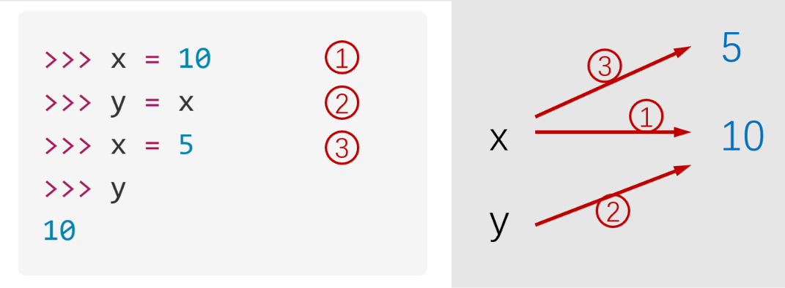
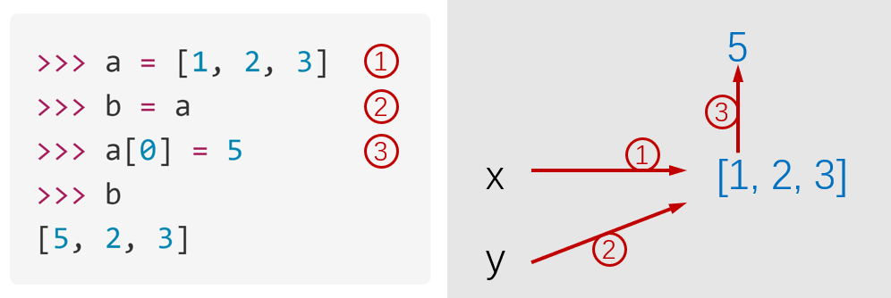

## 变量进阶 可变`mutable`、不可变`immutable`
### 1 可变与不可变
先来观察下两段代码，
看下这两段代码的区别。
1. 片段一
```python
>>> x = 10
>>> y = x
>>> x = 5
>>> y
10
```
2. 片段二
```python
>>> a = [1, 2, 3]
>>> b = a
>>> a[0] = 5
>>> b
[5, 2, 3]
```
简单分析会发现：
1中`y`不随`x`的变化而变化。
2中`b`随着`a`的变化而变化。

这样的情况，其缘由是可变对象`mutable objects`
和不可变对象`immutable objects`。
python中的常见的对象情况如下
- 不可变对象：`int`、`float`、`bool`、`str`、`tuple`
- 可变对象：`list`、`dict`

> 可变对象和不可变对象的本质区别；引用和值。
> 但这个介绍深了，就比较麻烦，感觉甚至涉及到c语言中的指针。

这里我选择用一种相对浅显，而又直观的方式
帮助大家理解这个可变对象和不可变对象。


片段一过程图示如下


片段二过程图示如下


补充：右边数字图标所在箭头，对应左边数字图标那一行代码执行效果。

**通过这个图示，大家应该容易想明白：**
**片段一，第三句直接让`x`变量指向了新的对象（值）。**
**片段二，第三句只是让`x`变量的内部属性（变量） 指向了新的对象（值），`x`和`y`还是对应的原本的对象（值）。**

同理有
```python
>>> c = {"a": 1, "b": 2}
>>> d = c
>>> d["a"] = 5
>>> c
{'a': 5, 'b': 2}
```

### 2 函数传参中的变化
猜一猜以下两段代码的输出是多少。
1. 片段一
```python
def change_one(y):
    y = 5

x = 10
change_one(x)
print(x)
```
2. 片段二
```python
def change_two(b):
    b[0] = 5

a = [1, 2, 3]
change_two(a)
print(a)
```

片段一的输出为`10`。
片段二的输出为`[5, 2, 3]`。

其原理和第一部分的可变对象不可变对象是一样的。

更细来讲，就是函数调用的时候，有一个隐藏的赋值操作。
把实参赋值给了形参。
即片段一调用代码`change_one(x)`中有赋值操作`y=x`,
即片段二调用代码`change_two(a)`中有赋值操作`b=a`。

由片段二，我们其实能发现一个问题。
就是把列表或者字典传到函数中的话，
函数内部如果修改了列表变量或字典变量，
会导致外面的也会更着变化，
这在很多时候会出问题。

### 3 复制拷贝(copy)
为了保证函数内，
对列表或字典的修改，
不会**污染**函数外，
我们常常会使用**拷贝**，
即新建一个内容一样的列表或字典。

根据现有知识，拷贝列表操作有以下几种
#### 使用循环拷贝列表
```python
x = [1, 2, 3, 4]
# copy start
x_copy = []
for item in x:
    x_copy.append(item)
# copy done
```
#### 使用切片拷贝列表
使用切片，能得到一个新的序列。

```python
x = [1, 2, 3, 4]

x_copy = x[:] # copy done
```

显然，使用切片更高效。
#### 通过循环拷贝字典
根据目前掌握的知识，暂时只能通过循环来拷贝字典
```python
c = {"a": 1, "b": 2}
# copy start
c_copy = {}
for k in c:
    c_copy[k] = c[k]
# copy done
```

#### 效果
拷贝之后，
修改原来的不会影响到新的，
修改新的也不会影响到缘来的。
示例如下
```python
def change_three(n)
    n_copy = n[:]
    n_copy[0] = 10

m = [1, 2, 3, 4]
change_three(m)
print(m)
```
输出为
```
[1, 2, 3, 4]
```
