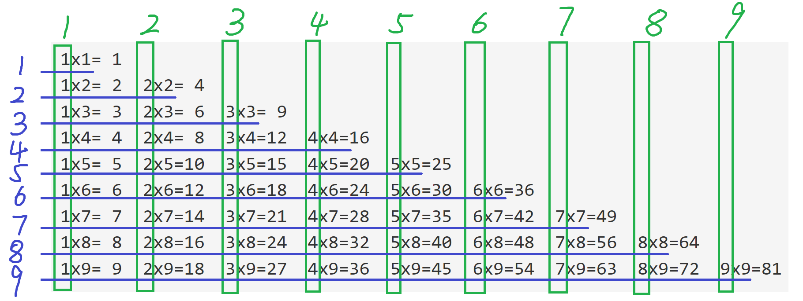
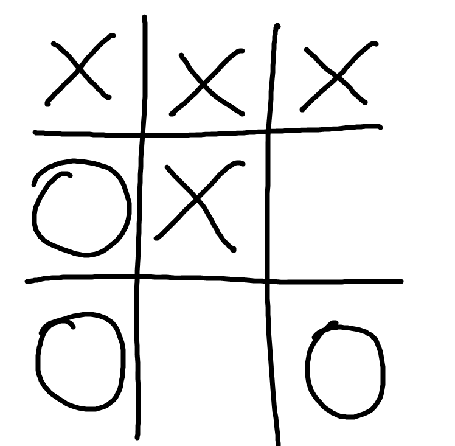
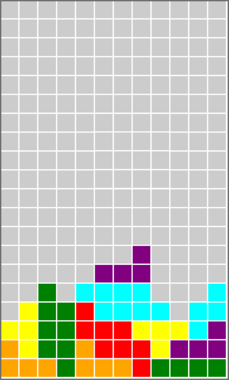
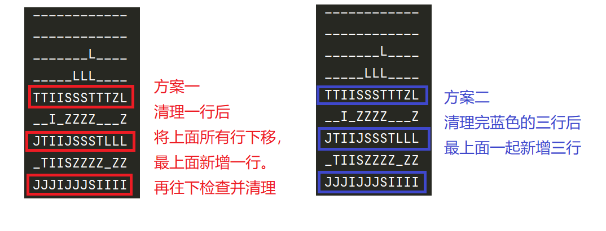

## 容器进阶 嵌套 二维列表

### 1 双层循环
双层循环，或者说嵌套循环，
在一个循环里套一个循环。

介绍嵌套容器之前，先介绍下嵌套循环。

这有什么用呢。

举一个例子，如何输出9x9乘法表。
```txt
1x1= 1  
1x2= 2  2x2= 4  
1x3= 3  2x3= 6  3x3= 9  
1x4= 4  2x4= 8  3x4=12  4x4=16  
1x5= 5  2x5=10  3x5=15  4x5=20  5x5=25  
1x6= 6  2x6=12  3x6=18  4x6=24  5x6=30  6x6=36  
1x7= 7  2x7=14  3x7=21  4x7=28  5x7=35  6x7=42  7x7=49  
1x8= 8  2x8=16  3x8=24  4x8=32  5x8=40  6x8=48  7x8=56  8x8=64  
1x9= 9  2x9=18  3x9=27  4x9=36  5x9=45  6x9=54  7x9=63  8x9=72  9x9=81
```

其实现代码如下
```python
for i in range(1, 10):
    for j in range(1, 10):
        if j <= i:
            print("{}x{}={:>2} ".format(j, i, i*j), end=" ")

    print()
```

此时再来分析下代码，
两层循环中的i和j分别代表了什么。



i代表的是其中蓝色的1-9
j代表的是绿色的1-9

两层循环:
第二层循环，用于输出一行上的具体的列，
即第二层循环执行完，就输出了一行。

第一层循环，用于输出多行，
具体是让第二层循环多次执行，从而输出多行。


理解i和j，最好从行与列的角度去理解。

### 2 认识嵌套列表

#### 初步介绍
列表里面嵌套列表，也常称为二维列表。
举个例子，这是个3x3(3行3列)的二位列表。

```python
[
    [0, 0, 0],
    [0, 0, 0],
    [0, 0, 0],
]
```

那么这样的列表有什么意义呢，
二维列表，常常用于去表示二维的格子游戏。
比如上面的3x3就可以用来表示井字棋。

#### 实例一 井字棋
比如下面的井字棋。



怎么用二维列表表示呢
这个时候其实有比较大的灵活度。
就是哪种棋子用哪个符号表示是我们可以选择的，
当然，不同的表示方式，
可能会让相关问题解决方式的难度也变得不同。

这里介绍两种表示方式（并不唯一，可以自由定义）。
1. 用数字
没有棋子的格子用`0`表示
有`X`棋子的格子用`1`表示
有`O`棋子的格子用`2`表示
那么上面的井字棋用列表表示如下
```python
board = [
    [1, 1, 1],
    [2, 1, 0],
    [2, 0, 2],
]
```
2. 用字母
没有棋子的格子用空格`" "`表示
有`X`棋子的格子用`"X"`表示
有`O`棋子的格子用`"O"`表示
那么上面的井字棋用列表表示如下
```python
board = [
    ["X", "X", "X"],
    ["O", "X", " "],
    ["O", " ", "O"],
]
```
#### 实例二 俄罗斯方块
> 之前做过一个[俄罗斯方块的教程](https://www.cnblogs.com/BigShuang/p/11638653.html)
> 但那整个教程对现阶段来讲，比较复杂。
> 这里只取其中的二维列表过来认识与分析。

这是一个该游戏中间过程截图（没有实现检查与清理功能）



这个时候游戏面板中的方格面板对应的二维列表情况如下。

```python
board = [
    ['', '', '', '', '', '', '', '', '', '', '', ''],
    ['', '', '', '', '', '', '', '', '', '', '', ''],
    ['', '', '', '', '', '', '', '', '', '', '', ''],
    ['', '', '', '', '', '', '', '', '', '', '', ''],
    ['', '', '', '', '', '', '', '', '', '', '', ''],
    ['', '', '', '', '', '', '', '', '', '', '', ''],
    ['', '', '', '', '', '', '', '', '', '', '', ''],
    ['', '', '', '', '', '', '', '', '', '', '', ''],
    ['', '', '', '', '', '', '', '', '', '', '', ''],
    ['', '', '', '', '', '', '', '', '', '', '', ''],
    ['', '', '', '', '', '', '', '', '', '', '', ''],
    ['', '', '', '', '', '', '', '', '', '', '', ''],
    ['', '', '', '', '', '', '', '', '', '', '', ''],
    ['', '', '', '', '', '', '', 'L', '', '', '', ''],
    ['', '', '', '', '', 'L', 'L', 'L', '', '', '', ''],
    ['', '', 'I', '', 'Z', 'Z', 'Z', 'Z', '', '', '', 'Z'],
    ['', 'T', 'I', 'I', 'S', 'Z', 'Z', 'Z', 'Z', '', 'Z', 'Z'],
    ['T', 'T', 'I', 'I', 'S', 'S', 'S', 'T', 'T', 'T', 'Z', 'L'],
    ['J', 'T', 'I', 'I', 'J', 'S', 'S', 'S', 'T', 'L', 'L', 'L'],
    ['J', 'J', 'J', 'I', 'J', 'J', 'J', 'S', 'I', 'I', 'I', 'I']
]
```

这是一个20x12 (20行12列) 的二维列表。

其中`''`空字符串对应空白格子。
`'O', 'S', 'T', 'I', 'L', 'J', 'Z'`等字母对应不同种类的俄罗斯方块，
有不同的颜色。

### 3 快速新建二维列表
#### 使用列表生成式
创建3行4列的空字符串组成的二位列表。
```python
board = [
    ["" for ci in range(4)] for ri in range(3)
]
```
`board`如下
```python
[
    ['', '', '', ''],
    ['', '', '', ''],
    ['', '', '', '']
]
```
#### 使用二层循环
创建3行4列的空字符串组成的二位列表。
```python
board = []
for ri in range(3):
    row = []
    for ci in range(4):
        row.append("")
    board.append(row)
```
`board`如下
```python
[
    ['', '', '', ''],
    ['', '', '', ''],
    ['', '', '', '']
]
```
### 4 嵌套列表初步使用
本小部分用到的二维列表如下
```python
board_1 = [
    ['1', '2', '3', '4'],
    ['A', 'B', 'C', 'D'],
    ['+', '-', '*', '/']
]
```

#### 0. 得到二维列表的行列总数(总行数，总列数)。
```python
r = len(board_1)
c = len(board_1[0])
```

#### 1. 根据行序号，列序号得到对应的值
得到`C`
```python
ri, ci = 1, 2
cell = board_1[ri][ci]
```

#### 2. 找到某个值对应的行列序号, 比如找到`-`的
```python
find_r, find_c = -1, -1  # 默认值，用于处理没找到的情况

r = len(board_1)
c = len(board_1[0])
for ri in range(r):
    for ci in range(c):
        if board[ri][ci] == "-":
            find_r, find_c = ri, ci
            break
```

#### 3. 得到某一行、某一列
得到某一行的所有格子，代码比较容易，如下(比如第一行)
```python
row1 = board[1]  # 结果为：['A', 'B', 'C', 'D']
```
得到一列相对麻烦一点，如下（得到第一列）
```python
column1 = [board[ri][1] for ri in range(r)]  # 结果为：['2', 'B', '-']
```


### 5 使用嵌套使用实例
#### 井字棋检测
以上面举得例子为例
```python
board = [
    ["X", "X", "X"],
    ["O", "X", " "],
    ["O", " ", "O"],
]
```
这个我们能看出来，是`"X"`对应得玩家赢了。
那么能不能实现一个程序，来判断是哪个玩家赢了呢?

具体一点，实现一个函数`get_ttt_winner(board)`，
接受一个3x3的二维列表`board`作为参数,
返回胜利玩家的棋子符号：`"X"`, `"O"`, `"N"`(没有人赢)。
补充: `ttt`是因为井字棋对应的英文是`Tic-Tac-Toe`。。。

思路分析：
这个时候，需要检查的是所有行，所有列，以及两个对角线。
这些本质上，都是三个格子组成的一串。

那么这里设计出一个对应的子函数`check_bunch_match(bunch, symbol)`。
能够检查三个格子组成的一串`bunch`是否是某个玩家的棋子`symbol`。
这样的解决总问题中的子问题的函数，常称为辅助函数`help function`。

代码思路框架如下
```python
def check_bunch_match(bunch, symbol):
    """
    判断 bunch 这一串棋子，是否都由symbol对应的棋子组成
    :param bunch: 一串棋子，三个棋子字符组成的列表
    :param symbol: 玩家棋子符号, "X" 或 "O"
    :return: bunch中的棋子都为 symbol，则返回 True，否则返回 False
    """
    pass


def get_ttt_winner(board):
    """
    :param board: 棋盘， 3x3的二维列表
    :return: 胜利玩家对应的字母"X"或者"O"， 没有胜利者则返回 "N"
    """
    r, c = len(board), len(board[0])
    for symbol in "XO":
        # 判断所有行
        for ri in range(r):
            row = [] # TODO
            if check_bunch_match(row, symbol):
                return symbol

        # 判断所有列
        for ci in range(c):
            column = [] # TODO
            if check_bunch_match(column, symbol):
                return symbol

        # 判断两个对角线
        diagonal_1 = [] # TODO
        diagonal_2 = [] # TODO
        if check_bunch_match(diagonal_1, symbol):
            return symbol
        if check_bunch_match(diagonal_2, symbol):
            return symbol

    return " "
```
测试示例
```python
r1 = check_bunch_match(["X", "X", "X"], "X")
r2 = check_bunch_match(["O", " ", "O"], "O")
r3 = check_bunch_match(["X", "X", "X"], "O")
r4 = check_bunch_match(["X", "X", "O"], "X")
print(r1, r2, r3, r4) # True False False False
```
```python

board1 = [
    ["X", "X", "X"],
    ["O", "X", " "],
    ["O", " ", "O"],
]
print(get_ttt_winner(board1)) # X

board2 = [
    ["X", "O", "X"],
    ["O", "X", " "],
    ["O", "X", "O"],
]
print(get_ttt_winner(board2)) # N

board3 = [
    ["X", " ", "X"],
    ["O", "X", "X"],
    ["O", "O", "O"],
]
print(get_ttt_winner(board3)) # O
```

---

无
意
义
的
分
割
线

---
实现代码如下
```python
def check_bunch_match(bunch, symbol):
    res = True
    for one in bunch:
        if one != symbol:
            res = False
            break

    return res

def get_ttt_winner(board):
    r, c = len(board), len(board[0])
    for symbol in "XO":
        for ri in range(r):
            row = board[ri]
            if check_bunch_match(row, symbol):
                return symbol

        for ci in range(c):
            column = [board[ri][ci] for ri in range(r)]
            if check_bunch_match(column, symbol):
                return symbol

        diagonal_1 = [board[ri][ri] for ri in range(r)]
        diagonal_2 = [board[ri][c-ri-1] for ri in range(r)]
        if check_bunch_match(diagonal_1, symbol):
            return symbol
        if check_bunch_match(diagonal_2, symbol):
            return symbol

    return "N"
```

调用语句如下
```python
board = [
    ["X", "X", "X"],
    ["O", "X", " "],
    ["O", " ", "O"],
]

r = get_ttt_winner(board)
print(r)
```

输出如下
```txt
X
```

#### 俄罗斯方块检测
上面给的俄罗斯方块例子中，没有实现检查与清理功能。
那么我们接下来实现这个功能。

具体一点，实现一个函数`check_and_clear(board)`，
接受一个二维列表`board`作为参数(`board`的行列数不确定，但都大于0),
检测是否有行上占满了俄罗斯方格，有则清理，
直接在`board`上操作，不用返回。

为了方便看到效果，函数中，清理完毕后，直接以可读性比较高的格式来展示`board`。
空格子展示为`_`， 有俄罗斯方块的格子，用方块对应的字符展示。
这里直接提供`show_board`展示对应效果
```python
def show_board(board):
    for row in board:
        for cell in row:
            if cell == "":
                print("_", end="")
            else:
                print(cell, end="")
        print()

board = [
    ['', '', '', '', '', '', '', '', '', '', '', ''],
    ['', '', '', '', '', '', '', '', '', '', '', ''],
    ['', '', '', '', '', '', '', '', '', '', '', ''],
    ['', '', '', '', '', '', '', '', '', '', '', ''],
    ['', '', '', '', '', '', '', '', '', '', '', ''],
    ['', '', '', '', '', '', '', '', '', '', '', ''],
    ['', '', '', '', '', '', '', '', '', '', '', ''],
    ['', '', '', '', '', '', '', '', '', '', '', ''],
    ['', '', '', '', '', '', '', '', '', '', '', ''],
    ['', '', '', '', '', '', '', '', '', '', '', ''],
    ['', '', '', '', '', '', '', '', '', '', '', ''],
    ['', '', '', '', '', '', '', '', '', '', '', ''],
    ['', '', '', '', '', '', '', '', '', '', '', ''],
    ['', '', '', '', '', '', '', 'L', '', '', '', ''],
    ['', '', '', '', '', 'L', 'L', 'L', '', '', '', ''],
    ['', '', 'I', '', 'Z', 'Z', 'Z', 'Z', '', '', '', 'Z'],
    ['', 'T', 'I', 'I', 'S', 'Z', 'Z', 'Z', 'Z', '', 'Z', 'Z'],
    ['T', 'T', 'I', 'I', 'S', 'S', 'S', 'T', 'T', 'T', 'Z', 'L'],
    ['J', 'T', 'I', 'I', 'J', 'S', 'S', 'S', 'T', 'L', 'L', 'L'],
    ['J', 'J', 'J', 'I', 'J', 'J', 'J', 'S', 'I', 'I', 'I', 'I']
]

show_board(board)
```
输出效果如下
```txt
____________
____________
____________
____________
____________
____________
____________
____________
____________
____________
____________
____________
____________
_______L____
_____LLL____
__I_ZZZZ___Z
_TIISZZZZ_ZZ
TTIISSSTTTZL
JTIIJSSSTLLL
JJJIJJJSIIII
```

思路分析：
该函数核心要解决两个问题
1. 需要一个子函数`check_row_complete(row)`，检查一行`row`是否填满。
2. 一行确认已填满后，则可以清理这一行，那么如何进行清理，这里有两个逻辑（都可行）



- 发现一行已填满，直接移除该行，移除一行后，将上面所有行都**下移**一行，同时新增一行。
- 发现一行已填满，直接移除该行，全部都移除后，在上面**直接补充**新行。

框架代码
```python
def show_board(board):
    for row in board:
        for cell in row:
            if cell == "":
                print("_", end="")
            else:
                print(cell, end="")
        print()


def check_row_complete(row):
    # 检查一行是否已经填满俄罗斯方格，已填满则返回True，否则返回False
    # TODO
    pass


def check_and_clear(board):
    r, c = len(board), len(board[0])
    for ri in range(r):
        if check_row_complete(board[ri]):
            # TODO
            pass

    # display
    show_board(board)
```

测试用例
1.
```python
board1 = [
    ['', '', '', '', '', '', '', '', '', '', '', ''],
    ['', '', '', '', '', '', '', '', '', '', '', ''],
    ['', '', '', '', '', '', '', 'L', '', '', '', ''],
    ['', '', '', '', '', 'L', 'L', 'L', '', '', '', ''],
    ['', '', 'I', '', 'Z', 'Z', 'Z', 'Z', '', '', '', 'Z'],
    ['', 'T', 'I', 'I', 'S', 'Z', 'Z', 'Z', 'Z', '', 'Z', 'Z'],
    ['T', 'T', 'I', 'I', 'S', 'S', 'S', 'T', 'T', 'T', 'Z', 'L'],
    ['J', 'T', 'I', 'I', 'J', 'S', 'S', 'S', 'T', 'L', 'L', 'L'],
    ['J', 'J', 'J', 'I', 'J', 'J', 'J', 'S', 'I', 'I', 'I', 'I']
]

check_and_clear(board1)
```
```txt
____________
____________
____________
____________
____________
_______L____
_____LLL____
__I_ZZZZ___Z
_TIISZZZZ_ZZ
```
2.
```python
board2 = [
    ['', '', '', '', '', '', '', '', '', '', '', ''],
    ['', '', '', '', '', '', '', '', '', '', '', ''],
    ['', '', '', '', '', '', '', 'L', '', '', '', ''],
    ['', '', '', '', '', 'L', 'L', 'L', '', '', '', ''],
    ['T', 'T', 'I', 'I', 'S', 'S', 'S', 'T', 'T', 'T', 'Z', 'L'],
    ['', '', 'I', '', 'Z', 'Z', 'Z', 'Z', '', '', '', 'Z'],
    ['J', 'T', 'I', 'I', 'J', 'S', 'S', 'S', 'T', 'L', 'L', 'L'],
    ['', 'T', 'I', 'I', 'S', 'Z', 'Z', 'Z', 'Z', '', 'Z', 'Z'],
    ['J', 'J', 'J', 'I', 'J', 'J', 'J', 'S', 'I', 'I', 'I', 'I']
]

check_and_clear(board2)
```
```txt
____________
____________
____________
____________
____________
_______L____
_____LLL____
__I_ZZZZ___Z
_TIISZZZZ_ZZ
```

---

分割线

下方为答案

---

参考答案
思路一
```python
def show_board(board):
    for row in board:
        for cell in row:
            if cell == "":
                print("_", end="")
            else:
                print(cell, end="")
        print()

def check_row_complete(row):
    for cell in row:
        if cell=='':
            return False

    return True

def check_and_clear(board):
    has_complete_row = False
    r, c = len(board), len(board[0])
    for ri in range(r):
        if check_row_complete(board[ri]):
            # 当前行可消除
            if ri > 0:
                for cur_ri in range(ri, 0, -1):
                    board[cur_ri] = board[cur_ri-1][:]
                board[0] = ['' for j in range(c)]
            else:
                board[ri] = ['' for j in range(c)]

    # display
    show_board(board)
```

思路二的`check_and_clear`
```python
def check_and_clear(board):
    r, c = len(board), len(board[0])
    to_del_row = []
    for ri in range(r):
        if check_row_complete(board[ri]):
            to_del_row.append(ri)

    for ri in to_del_row[::-1]: # reverse
        board.pop(ri)

    for _ in to_del_row:
        # 每次生成新的row，不会相互干扰
        row = ['' for ci in range(c)]
        board.insert(0, row)

    # display
    show_board(board)
```


### 6 简单回顾
#### 二维列表常用语法
获取总行数和总列数。
```python
r = len(board)
c = len(board[0])
```
得到第`ri`行，第`ci`的内容: `board[ri][ci]`
