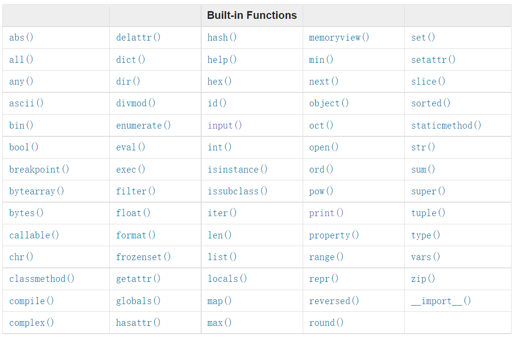

## 函数进阶 内置函数(Built-in Functions)
### 1 概览
> 官网文档 DOC: [Built-in Functions](https://docs.python.org/3.7/library/functions.html)

> The Python interpreter has a number of functions and types built into it that are always available. They are listed here in alphabetical order.
> Python 解释器内置了很多函数和类型，我们可以在任何时候使用它们。以下按字母表顺序列出它们。



上方截图展示的就是python的内置函数(图中共有69个)。

现在可以回顾下我们已经学了(基本认识)哪些内置函数。

罗列如下(共15个)
- `bool()`
- `dict()`
- `float()`
- `input()`
- `int()`

- `isinstance()`
- `len()`
- `list()`
- `open()`
- `print()`

- `range()`
- `round()`
- `str()`
- `tuple()`
- `type()`

### 2 常用介绍
这里额外拓展介绍一些
常用的内置函数

#### `enumerate`
之前的遍历列表，有两种方法
- `for item in a_list`: 遍历所有项
- `for index in range(len(a_list))`: 遍历所有项的索引

`enumerate`可以简单认为是这两者之和。
能同时遍历索引和值，
其常用语法为`for index, item in enumerate(a_list)`

使用示例
```python
>>> for index, item in enumerate(seasons):
...	    print(index, item)
...
0 Spring
1 Summer
2 Fall
3 Winter
```

> 官方详细介绍如下(节选)
> `enumerate(iterable, start=0)`
> Return an enumerate object.
> 返回一个`enumerate`对象
> The `__next__()` method of the iterator returned by enumerate() returns a tuple containing a count (from start which defaults to 0) and the values obtained from iterating over iterable.
> 返回值可遍历，每次遍历得到的项为一个元组
> 包含计数变量(从start开始，start默认值为0)和值（由传入的可迭代对象迭代出的）
> ```python
> >>> seasons = ['Spring', 'Summer', 'Fall', 'Winter']
> >>> list(enumerate(seasons))
> [(0, 'Spring'), (1, 'Summer'), (2, 'Fall'), (3, 'Winter')]
> >>> list(enumerate(seasons, start=1))
> [(1, 'Spring'), (2, 'Summer'), (3, 'Fall'), (4, 'Winter')]
> ```

#### `sorted`
常用于对列表进行排序，
实际上也可以对`iterable`进行排序，
返回一个新的排好序的列表。

排序结果，默认是升序的，
可以通过设置关键字参数`reverse`为`True`(默认值为`False`)，
来实现降序排序。

```python
>>> arr = [5, 2, 3, 1, 4]
>>> sorted(arr)
[1, 2, 3, 4, 5]
>>> sorted(arr, reverse=True)
[5, 4, 3, 2, 1]
```

### 3 拓展了解

以下函数相对常用，
这里做一个简单介绍

#### 简单（相对常用）：
- `abs(x)`:
   Return the absolute value of a number. The argument may be an integer or a floating point number.
   返回数字的绝对值。 参数可以是整数或浮点数。
- `pow(x, y)`
   Return x to the power y.
   返回 x 的 y 次方， 即$x^y$。
   其实和`x**y`效果差不多。

```python
>>> abs(5)
5
>>> abs(-3)
3
>>> abs(-4.8)
4.8
>>> pow(5, 2)
25
>>> pow(2, 10)
1024
>>> pow(2, 1/2)
1.4142135623730951
>>> pow(2, -2)
0.25
```

- `min(iterable)`, `min(arg1, arg2, *args)`:
   Return the smallest item in an iterable or the smallest of two or more arguments.
   返回可迭代项中的最小项, 或两个或多个参数中的最小项。
- `max(iterable)`, `max(arg1, arg2, *args)`:
   Return the largest item in an iterable or the largest of two or more arguments.
   返回可迭代对象中的最大项, 或两个或多个参数中最大的一个。
- `sum(iterable)`:
   Sums the items of an iterable from left to right and returns the total.
   从左到右对 iterable 的项目求和并返回总数。

简单说明： `min`和`max`都可以接受多个参数，或者一个可迭代对象。

```python
>>> min(1, 3, 2, 5, 4)
1
>>> arr = [1, 3, 2, 5, 4]
>>> min(arr)
1
>>> max(arr)
5
>>> max(1, 3, 2, 5, 4)
5
>>> sum(arr)
15
```

#### 较难（比较少见）
以下较难，感兴趣可以自行了解，这里就先不展开介绍了
较难：
- `all()`
- `any()`

### 4 简单练习
使用列表生成式的语法，
用下面列表中的数全部取绝对值（生成一个新的由其绝对值构成的列表）。
注：不用新建文件，直接交互式命令行里敲就可以了。

```python
arr = [1, 3, -2, 5, 9, -6, 7, -8, 4]
```
生成新数组如下应当如下
```python
[1, 3, 2, 5, 9, 6, 7, 8, 4]
```

---

没有意义的分割线
。
。
。
。
。

---

答案
```python
arr2 = [abs(item) for item in arr]
```
