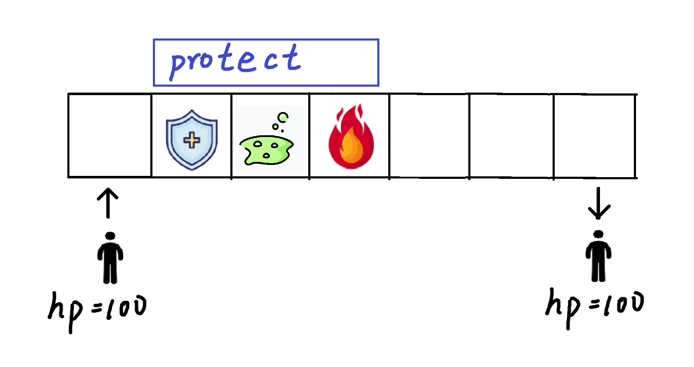

## 面向对象编程 实例演示 简易方格游戏（一维）

### 1 介绍

#### 背景介绍

其实最早是想模拟一下魔塔的那种
[https://h5mota.com/games/24/](https://h5mota.com/games/24/)

但是就算是反复简化后，打怪也过于复杂。

所以直接调整成了超级简单的方格游戏。

这个是第一部分，先实现一个简易的一维的效果，主要是演示讲解。
下一节是第二部分，会实现一个小巧的二维的效果，作为练习。

#### 游戏介绍
方格游戏简化后，示意图如下


上面有空白方格，有火焰的方格，有小心心的方格，我们把这些方格用以下字符表示

`"_"`: 空白格子, Blank,
`"*"`: 星星格子, Star, 会让玩家hp+10
`"#"`: 火焰格子, Fire, 会让玩家hp-10

那么以上六个方格可以用一行字符串表示:
`_##_*_`

一名玩家（默认hp为100）从最左侧走到最右侧，展示中间过程，和最后结果。

示例输出如下：
```txt
Player current loc: 0, current hp: 100
Player current loc: 1, current hp: 100
    Player hp change: -10. Current hp: 90
Player current loc: 2, current hp: 90
    Player hp change: -10. Current hp: 80
Player current loc: 3, current hp: 80
Player current loc: 4, current hp: 80
    Player hp change: 10. Current hp: 90
Player current loc: 5, current hp: 90
=== FINAL STATE ===
Player current loc: 5, current hp: 90
```

### 2 思路分析
#### 方格类
由于要面向对象编程，所以我们把每个格子都看作一个对象，因此需要一个对应的方格类。

那么目前就需要三个类
- `Blank`, 空白格子类， 其他类以此为基类
- `Star`, 星星格子类
- `Fire`, 火焰格子类

目前这些类别都不需要属性，只要两个方法
- `__init__`: 基本的构造器方法
- `action`: 对玩家施加动作（或者说影响），`Star`会让玩家血量-10，
   `Fire`会让玩家血量+10

#### 玩家类
也有个玩家类`Player`。
属性
- `hp`: 血量
- `loc`: 坐标，一维的话，一个索引数字就够了

方法
- `move`: 实现玩家的移动
- `change_hp`: 修改玩家血量
- `show_info`: 展示玩家信息

#### 游戏总控类

最后我们需要一个游戏类 `Game` 来管理与控制
其需要的属性:
- `player`: 玩家对象
- `grids`: 格子容器， 一维列表


方法:
- `__init__`: 能够读取一行格子字符，生成对应的格子对象，并放入`grids`中（从而使用与管理）

- `run`: 实际运行，让玩家从左走到右边。

### 3 逐步实现
#### 搭起框架
根据第二部的分析，可以搭起框架如下
```python
class Blank:
    def __init__(self):
        pass

    def action(self, player):
        pass


class Fire(Blank): # hp - 10
    def action(self, player):
        pass


class Star(Blank): # hp + 10
    def action(self, player):
        pass


class Player:
    def __init__(self, loc, hp=100):
        pass

    def move(self, grids):
        pass

    def change_hp(self, diff):
        pass

    def show_info(self):
        pass


class Game:
    def __init__(self, grid_line):
        pass

    def run(self):
        pass


grid_line1 = "_##_*_"
g1 = Game(grid_line1)
g1.run()
```

#### 实现`Game`
为了根据字符确定对应的类`Class`，
这里使用一个特殊的技巧，
添加一个`grid_map`对象，来实现对应关系。

实现`Game`部分的代码如下
```python
grid_map = {
    "_": Blank,
    "#": Fire,
    "*": Star,
}


class Game:
    def __init__(self, grid_line):
        self.player = Player(0, 100)
        self.grids = []

        for i in range(len(grid_line)):
            char = grid_line[i]
            gridClass = grid_map[char]
            grid = gridClass()
            self.grids.append(grid)

    def run(self):
        for i in range(len(self.grids)):
            cur_grid = self.grids[self.player.loc]
            self.player.show_info()
            cur_grid.action(self.player)
            if i < len(self.grids) -1: # 到最后一个格子之后不能再右移了
                self.player.move(self.grids)

        print("=== FINAL STATE ===")
        self.player.show_info()
```

#### 实现`Player`

```python
class Player:
    def __init__(self, loc, hp=100):
        self.loc = loc
        self.hp = hp

    def move(self, grids):
        if self.loc + 1 < len(grids):
            self.loc += 1

    def change_hp(self, diff):
        self.hp += diff
        print("    Player hp change: %s. Current hp: %s" % (diff, self.hp))

    def show_info(self):
        print("Player current loc: %s, current hp: %s" % (self.loc, self.hp))
```
#### 实现方格
```python
class Fire(Blank): # hp - 10
    def action(self, player):
        player.change_hp(-10)


class Star(Blank): # hp + 10
    def action(self, player):
        player.change_hp(10)
```

#### 总代码
```python
class Blank:
    def __init__(self):
        pass

    def action(self, player):
        pass


class Fire(Blank): # hp - 10
    def action(self, player):
        player.change_hp(-10)


class Star(Blank): # hp + 10
    def action(self, player):
        player.change_hp(10)


class Player:
    def __init__(self, loc, hp=100):
        self.loc = loc
        self.hp = hp

    def move(self, grids):
        if self.loc + 1 < len(grids):
            self.loc += 1

    def change_hp(self, diff):
        self.hp += diff
        print("    Player hp change: %s. Current hp: %s" % (diff, self.hp))

    def show_info(self):
        print("Player current loc: %s, current hp: %s" % (self.loc, self.hp))


grid_map = {
    "_": Blank,
    "#": Fire,
    "*": Star,
}


class Game:
    def __init__(self, grid_line):
        self.player = Player(0, 100)
        self.grids = []

        for i in range(len(grid_line)):
            char = grid_line[i]
            gridClass = grid_map[char]
            grid = gridClass()
            self.grids.append(grid)

    def run(self):
        for i in range(len(self.grids)):
            cur_grid = self.grids[self.player.loc]
            self.player.show_info()
            cur_grid.action(self.player)
            if i < len(self.grids) -1: # 到最后一个格子之后不能再右移了
                self.player.move(self.grids)

        print("=== FINAL STATE ===")
        self.player.show_info()


grid_line1 = "_##_*_"
g1 = Game(grid_line1)
g1.run()
```

### 4 格子拓展
#### Poison

实现一个`Poison`格子，能让玩家进入中毒状态，持续减伤（连着三个格子，每过一个格子都会-10HP)

`Poison`格子用`!`表示

示例1


`grid_line1 = "_!__*_"`
输出如下
```txt
Player current loc: 0, current hp: 100.
Player current loc: 1, current hp: 100.
    Decrease HP due to poisoning
    Player hp change: -10. Current hp: 90
Player current loc: 2, current hp: 90. Status: poison(2) .
    Decrease HP due to poisoning
    Player hp change: -10. Current hp: 80
Player current loc: 3, current hp: 80. Status: poison(1) .
    Decrease HP due to poisoning
    Player hp change: -10. Current hp: 70
Player current loc: 4, current hp: 70.
    Player hp change: 10. Current hp: 80
Player current loc: 5, current hp: 80.
=== FINAL STATE ===
Player current loc: 5, current hp: 80.
```

示例2


`grid_line2 = "_!#___"`
输出如下
```txt
Player current loc: 0, current hp: 100.
Player current loc: 1, current hp: 100.
    Decrease HP due to poisoning
    Player hp change: -10. Current hp: 90
Player current loc: 2, current hp: 90. Status: poison(2) .
    Player hp change: -10. Current hp: 80
    Decrease HP due to poisoning
    Player hp change: -10. Current hp: 70
Player current loc: 3, current hp: 70. Status: poison(1) .
    Decrease HP due to poisoning
    Player hp change: -10. Current hp: 60
Player current loc: 4, current hp: 60.
Player current loc: 5, current hp: 60.
=== FINAL STATE ===
Player current loc: 5, current hp: 60.
```

#### 思路
玩家要添加一个状态`status`属性，考虑到除了中毒，未来还有可能有其他状态，我们这里推荐使用字典记录。

中毒后玩家状态变成
`{"poison": 3}`， 每过一个格子血量减10， 且键值对的值减少1，减少到0的时候说明中毒状态解除。

#### 修改Player
```python
class Player:
    def __init__(self, loc, hp=100):
        self.loc = loc
        self.hp = hp
        self.status = {}

    def set_status(self, status, steps):
        self.status[status] = steps

    def update_status(self):
        poison_steps = self.status.get("poison", 0)
        if poison_steps>0:
            print("    Decrease HP due to poisoning")
            self.change_hp(-10)
            self.status["poison"] -= 1

    def move(self, grids):
        if self.loc + 1 < len(grids):
            self.loc += 1

    def change_hp(self, diff):
        self.hp += diff
        print("    Player hp change: %s. Current hp: %s" % (diff, self.hp))

    def show_info(self):
        s = "Player current loc: %s, current hp: %s. " % (self.loc, self.hp)
        for key in self.status:
            if self.status[key] > 0:
                s += "Status: %s(%s) . " % (key, self.status[key])

        print(s)
```

#### 实现Poison
```python
class Poison(Blank): # hp -10 * 3
    def action(self, player):
        player.set_status('poison', 3)
```

同时修改`grid_map`，在其中加上`Posison`, 修改后如下
```python
grid_map = {
    "_": Blank,
    "#": Fire,
    "*": Star,
    "!": Poison
}
```

#### 修改Game
Game的run方法中，在`cur_grid.action(self.player)` 之后添加一行代码如下
```python
self.player.update_status()
```

#### 总代码
```python
class Blank:
    def __init__(self):
        pass

    def action(self, player):
        pass


class Fire(Blank): # hp - 10
    def action(self, player):
        player.change_hp(-10)


class Star(Blank): # hp + 10
    def action(self, player):
        player.change_hp(10)


class Poison(Blank): # hp -10 * 3
    def action(self, player):
        player.set_status('poison', 3)


class Player:
    def __init__(self, loc, hp=100):
        self.loc = loc
        self.hp = hp
        self.status = {}

    def set_status(self, status, steps):
        self.status[status] = steps

    def update_status(self):
        poison_steps = self.status.get("poison", 0)
        if poison_steps>0:
            print("    Decrease HP due to poisoning")
            self.change_hp(-10)
            self.status["poison"] -= 1

    def move(self, grids):
        if self.loc + 1 < len(grids):
            self.loc += 1

    def change_hp(self, diff):
        self.hp += diff
        print("    Player hp change: %s. Current hp: %s" % (diff, self.hp))

    def show_info(self):
        s = "Player current loc: %s, current hp: %s. " % (self.loc, self.hp)
        for key in self.status:
            if self.status[key] > 0:
                s += "Status: %s(%s) . " % (key, self.status[key])

        print(s)


grid_map = {
    "_": Blank,
    "#": Fire,
    "*": Star,
    "!": Poison
}


class Game:
    def __init__(self, grid_line):
        self.player = Player(0, 100)
        self.grids = []

        for i in range(len(grid_line)):
            char = grid_line[i]
            gridClass = grid_map[char]
            grid = gridClass()
            self.grids.append(grid)

    def run(self):
        for i in range(len(self.grids)):
            cur_grid = self.grids[self.player.loc]
            self.player.show_info()
            cur_grid.action(self.player)
            self.player.update_status()
            if i < len(self.grids) -1: # 到最后一个格子之后不能再右移了
                self.player.move(self.grids)

        print("=== FINAL STATE ===")
        self.player.show_info()


grid_line1 = "_!__*_"
g1 = Game(grid_line1)
g1.run()
```

### 5 防护格子练习
#### Protect
实现一个`Protect`格子，能让玩家进入防护状态，持续免疫伤害（连着三个格子，挡住所有伤害，也能挡住中毒状态)。
如果当前有中毒状态，直接解除。

`Poison`格子用`+`表示

示例1


`grid_line1 = "_!+_#__"`输出如下
```txt
Player current loc: 0, current hp: 100.
Player current loc: 1, current hp: 100.
    Decrease HP due to poisoning
    Player hp change: -10. Current hp: 90
Player current loc: 2, current hp: 90. Status: poison(2) .
    Protected. Clear Poison
Player current loc: 3, current hp: 90. Status: protect(2) .
Player current loc: 4, current hp: 90. Status: protect(1) .
    Protected. Decease hp Invalid.
Player current loc: 5, current hp: 90.
Player current loc: 6, current hp: 90.
=== FINAL STATE ===
Player current loc: 6, current hp: 90.
```

示例2

`grid_line2 = "_+###_"`输出如下
```txt
Player current loc: 0, current hp: 100.
Player current loc: 1, current hp: 100.
Player current loc: 2, current hp: 100. Status: protect(2) .
    Protected. Decease hp Invalid.
Player current loc: 3, current hp: 100. Status: protect(1) .
    Protected. Decease hp Invalid.
Player current loc: 4, current hp: 100.
    Player hp change: -10. Current hp: 90
Player current loc: 5, current hp: 90.
=== FINAL STATE ===
Player current loc: 5, current hp: 90.
```

示例3

`grid_line3 = "_+!#__"`输出如下
```txt
Player current loc: 0, current hp: 100.
Player current loc: 1, current hp: 100.
Player current loc: 2, current hp: 100. Status: protect(2) .
    Protected. Poison Invalid.
Player current loc: 3, current hp: 100. Status: protect(1) .
    Protected. Decease hp Invalid.
Player current loc: 4, current hp: 100.
Player current loc: 5, current hp: 100.
=== FINAL STATE ===
Player current loc: 5, current hp: 100.
```

#### 思路
1. 修改`Player`的`set_status`方法
- 设置保护状态时，可以清理掉中毒状态。
`"    Protected. Clear Poison"`
- 处于保护状态时，设置中毒，会被挡住。
`"    Protected. Poison Invalid."`

2. 修改`Player`的`update_status`方法。
获取中毒状态和防护状态，并分别处理

3. 修改`Player`的`change_hp`方法。
处于防护状态时，减少血量的改变会被拦下
`"    Protected. Decease hp Invalid."`

4. 添加`Protect`类， 并更新`grid_map`

#### 代码如下

改动处代码如下
```python
class Protect(Blank): # 未来2步 免疫任何伤害
    def action(self, player):
        player.set_status('protect', 3)


class Player:
    def __init__(self, loc, hp=100):
        self.loc = loc
        self.hp = hp
        self.status = {
            "protect": 0,
            "poison": 0
        }

    def set_status(self, status, steps):
        if status == "protect":
            if self.status["poison"] > 0:
                print("    Protected. Clear Poison")
                self.status["poison"] = 0
            self.status["protect"] = steps
        elif status == "poison":
            if self.status["protect"] > 0:
                print("    Protected. Poison Invalid.")
            else:
                self.status["poison"] = steps

    def update_status(self):
        poison_steps = self.status.get("poison", 0)
        protect_steps = self.status.get("protect", 0)
        if poison_steps > 0:
            print("    Decrease HP due to poisoning")
            self.change_hp(-10)
            self.status["poison"] -= 1

        if protect_steps > 0:
            self.status["protect"] -= 1

    def move(self, grids):
        if self.loc + 1 < len(grids):
            self.loc += 1

    def change_hp(self, diff):
        if diff < 0 and self.status.get("protect") > 0:
            print("    Protected. Decease hp Invalid.")
            return

        self.hp += diff
        print("    Player hp change: %s. Current hp: %s" % (diff, self.hp))

    def show_info(self):
        s = "Player current loc: %s, current hp: %s. " % (self.loc, self.hp)
        for key in self.status:
            if self.status[key] > 0:
                s += "Status: %s(%s) . " % (key, self.status[key])

        print(s)


grid_map = {
    "_": Blank,
    "#": Fire,
    "*": Star,
    "!": Poison,
    "+": Protect
}
```
